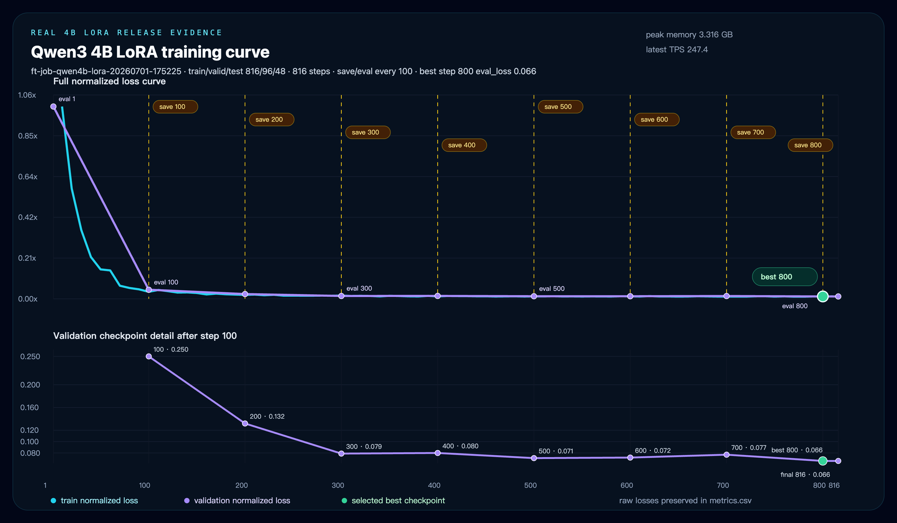

# First LLM Studio

[English](#english) | [简体中文](#简体中文)


---

# English

First LLM Studio is a local-first LLM workbench for Apple Silicon. It brings local MLX runtimes, remote API targets, Agent sessions, Compare, Fine-tune, Benchmark, model discovery, runtime recovery, release evidence, and admin monitoring into one operating surface.

It is not another chat shell. It is built for people who need to compare behavior, debug runtimes, run evals, prepare adapters, and keep local and remote model work inside one product loop.

## Product Surfaces

| Route | Core workflow |
| --- | --- |
| `/agent` | Tool-enabled Agent sessions, target selection, runtime state, replay, trace review, and embedded Compare entry. |
| `/compare` | Route-owned Compare Studio for prompt composition, lane preview, recipe persistence, review drawer, and benchmark handoff. |
| `/fine-tune` | Foreground Fine-tune Studio for datasets, recipes, training, evaluation, chat adapter proof loops, export, reports, and artifacts. |
| `/models` | Model discovery and install verification for local/community models plus hardware-fit and risk signals. |
| `/benchmarks` | Benchmark run controls, progress, reports, release evidence, baselines, and regression review. |
| `/retrieval` | Foreground knowledge management, path import, chunk inspection, and grounded retrieval validation. |
| `/experiments` | Unified run/session timeline with artifact lineage, cross-feature navigation, filters, and retention controls. |
| `/admin` | Monitoring/configuration mirror for runtime, queues, benchmark history, provider health, guardrails, and audit timelines. |

## Major Version Story

| Version | Core capabilities |
| --- | --- |
| `v0.1` Foundation | Established the local-first web studio, Apple Silicon/MLX gateway workflow, local + remote target catalog, runtime telemetry, and the first Agent/Admin operating split. |
| `v0.2` Agent + Benchmark Ops | Added richer Agent workbench flows, Compare-style target review, replay/trace inspection, runtime recovery controls, formal benchmark operations, baselines, and regression evidence. |
| `v0.3` Fine-tune + Release Evidence | Added fine-tune operation loops for evaluation, adapter chat, adapter export, and distillation starters; expanded operation history, partitioned typechecks, screenshot smoke, route smoke, and public launch assets. |
| `v0.4` Product IA release | Moves `/fine-tune`, `/compare`, `/models`, `/benchmarks`, `/retrieval`, and `/experiments` into foreground product routes with feature-owned state/actions, artifact lineage and retention, dark-glass studio/workbench styling, canonical APIs, and admin narrowed toward monitoring/configuration. |
| `v0.4.1` Stability baseline | Repairs dataless workspace failure modes, keeps route smoke and typecheck green, updates the OpenAI-compatible `/v1` surface, refreshes provider status reporting, captures current real UI evidence, and archives a real Qwen3 4B LoRA run with checkpoint/report/chart evidence. |
| `v0.4.2` Evidence patch | Formalizes the GitHub/ModelScope high-resolution screenshot sync, documents the README-facing LFS threshold fix, and preserves the v0.4.1 LoRA evidence as the stable public baseline while v0.5.0 work starts. |
| `v0.5` Starter track | Enterprise RAG, deployment registry, OpenAI-compatible API, telemetry, release-readiness gates, production attestation, and control-plane rehearsal work continue behind explicit preview gates until promoted. |
| `v1.0` Integrated GA baseline | Unifies Agent, Compare, Model Hub, Retrieval, Fine-tune, Benchmark, Experiments, Admin monitoring, thin application APIs, route ownership, release security, and reproducible evidence contracts. |
| `v1.1.0-rc.1` Desktop Onboarding | Adds a self-contained Apple Silicon app with bundled Node, ZIP/DMG packaging, first-run diagnosis, permission and service recovery, migration/update/rollback/uninstall rehearsals, a real Ollama local-chat proof, and clean-profile boot evidence. Developer ID notarization remains a separate GA gate. |
| `v1.1.0-rc.2` Desktop Distribution Gate | Replaces the shell entrypoint with a native arm64 launcher and adds nested-code/app/DMG signing, dual notarization logs, staple/Gatekeeper verification, a portable clean-machine runner, and RSA-signed organization receipts with an out-of-band trust pin. Real external receipts still gate GA. |

Current release: [`VERSION`](./VERSION).

Latest release candidate notes: [`v1.1.0-rc.2`](./docs/releases/v1.1.0-rc.2_2026-07-16.md). The production workflow is executable and fail-closed; this repository does not represent missing Apple or organization receipts as completed distribution evidence.

## Competitive Position

Reviewed against official product documentation on 2026-07-12. **Core** means a first-party primary workflow; **integrated** means the capability exists but is not the product's deepest specialization; **ecosystem** means it is normally assembled through adjacent clients or plugins. "Not primary" does not mean technically impossible.

| Product | Strongest position | Local runtime / Model Hub | Agent / RAG | Fine-tune / LoRA | Evaluation / operational evidence |
| --- | --- | --- | --- | --- | --- |
| **First LLM Studio** | Evidence-driven local model lifecycle | **Core**, MLX and hardware-aware | **Core**, tools + Compare + ACL/citations | **Core**, recipe-to-best-checkpoint-to-adapter lifecycle | **Core**, Benchmark + lineage + fail-closed release gates |
| [LM Studio](https://lmstudio.ai/docs/developer/core/server) | Polished desktop discovery and local serving | **Core**, GUI/CLI load, download, unload and compatible APIs | **Integrated** through API, tools and MCP | Not primary | Runtime/developer inspection |
| [Ollama](https://docs.ollama.com/api/introduction) | Simple model runtime and packaging | **Core**, stable local API and model lifecycle | **Ecosystem**, with native tool calling | Not primary | Ecosystem |
| [Open WebUI](https://docs.openwebui.com/features/) | Self-hosted team AI workspace | **Integrated**, multi-provider | **Core**, hybrid RAG, reranking, tools and MCP | Not primary | **Integrated**, arena/A-B/ELO, analytics and OTel |
| [Jan](https://www.jan.ai/docs/desktop/api-server) | Open-source cross-platform desktop assistant | **Core**, llama.cpp/MLX and configurable local server | **Integrated**, agents/projects/MCP | Not primary | Server logs and developer inspection |
| [AnythingLLM](https://docs.anythingllm.com/) | Workspace RAG and agent automation | **Integrated**, multi-provider | **Core**, workspaces, flows, skills and scheduled jobs | Not primary | Logs and flow runs |
| [LLaMA-Factory](https://github.com/hiyouga/LlamaFactory) | Efficient training breadth and depth | Training/inference tooling | Task-focused tool-use tuning | **Core**, broad LoRA/QLoRA and preference methods | **Core** training monitors and benchmark integrations |
| [LocalAI](https://localai.io/) | Modular multi-backend private AI runtime | **Core**, broad hardware/backends and distributed workers | **Core**, agents/MCP/RAG/citations | **Integrated** | Runtime and control-plane operations |

First LLM Studio's advantage is the connected evidence chain across Agent, Compare, Retrieval, Benchmark, Fine-tune, adapter export, and release review. Its clearest gaps are desktop distribution, runtime breadth, extension ecosystem, team identity/governance, visual workflow authoring, and real multi-node/cloud production evidence. See the full bilingual [competitive landscape and product direction](./docs/competitive-landscape.md), including methodology, limitations, official sources, and the post-v1 adoption principles.

## Who It Helps

### Local AI builders on Apple Silicon

- Compare MLX local models against hosted APIs under aligned context budgets.
- Inspect runtime cost, prewarm, release, recovery, and hardware pressure without leaving the app.
- Decide which local model is actually usable for daily coding and analysis workflows.

### Agent and tooling teams

- Validate tool-calling, repo-grounded behavior, replay, and patch flows in one workbench.
- Turn Compare runs into benchmark handoff without switching products.
- Separate model-quality failures from provider quirks and local runtime instability.

### Evaluation and platform engineers

- Run formal and focused benchmark suites with repeatable profiles.
- Review baselines, deltas, run notes, failure classifications, and release evidence.
- Keep local and remote targets inside one comparable target catalog.

## Core Value

- Unified local + remote target catalog.
- Compare Lab for model-vs-model output review.
- Fine-tune workflows for datasets, recipes, training, evaluation, adapter proof loops, export, best-checkpoint selection, and LoRA release evidence.
- Benchmark operations with history, progress, baselines, reports, and release evidence.
- Foreground Retrieval for document import, chunk inspection, and grounded evidence probes.
- Experiments timeline for session/run lineage, artifact navigation, and retention policy.
- Replay, trace review, patch inspection, and exportable review notes.
- Runtime operations for prewarm, release, restart, log inspection, telemetry, and recovery.
- Dynamic local/community model discovery plus remote provider health scanning.

## Current Targets

### Local

- `Local Qwen3 0.6B`
- `Local Qwen3 4B 4-bit`
- `Local Qwen3.5 4B 4-bit`
- `Local Gemma 3 4B It Qat 4-bit`

### Remote

- `OpenAI Codex`
- `OpenAI GPT-5.5`
- `Claude API`
- `DeepSeek API`
- `Kimi API`
- `GLM API`
- `Qwen API`

## Screenshots

Captured from the running local app after `npm run typecheck` and `npm run smoke:routes`. README screenshots are generated with `npm run screenshots:readme` at 2x DPR so text stays sharp on GitHub and ModelScope; the LoRA evidence chart is exported from SVG at 2x DPR.

Agent workbench with target catalog, runtime rail, and tool-enabled composer:


Fine-tune Studio with workflow tabs, training controls, and report/evidence panels:


Fine-tune completed run with live loss curves, train/validation traces, and handoff actions:


Real Qwen3 4B LoRA release evidence with save/eval markers and selected best checkpoint:



Vector version: [`fine-tune-qwen4b-lora-chart.svg`](./docs/assets/screenshots/fine-tune-qwen4b-lora-chart.svg). Full run archive and manifest: [`docs/release-evidence/finetune-qwen4b-lora-2026-07-01`](./docs/release-evidence/finetune-qwen4b-lora-2026-07-01).

Benchmark Studio with run controls and historical evidence cards:


Benchmark run evidence from a real local smoke run:


Models Studio with hardware-fit chips and one-click community discovery:


Compare, Retrieval, and Admin surfaces:


## Quick Start

### Requirements

- macOS on Apple Silicon
- Node `22.x`
- Python `3.12`
- MLX-compatible local environment

### Install

```bash
nvm install 22
nvm use 22
npm install
cp .env.example .env.local
```

### Start the web app

```bash
npm run dev
```

Default routes:

- [http://localhost:3011/agent](http://localhost:3011/agent)
- [http://localhost:3011/compare](http://localhost:3011/compare)
- [http://localhost:3011/fine-tune](http://localhost:3011/fine-tune)
- [http://localhost:3011/models](http://localhost:3011/models)
- [http://localhost:3011/benchmarks](http://localhost:3011/benchmarks)
- [http://localhost:3011/retrieval](http://localhost:3011/retrieval)
- [http://localhost:3011/experiments](http://localhost:3011/experiments)
- [http://localhost:3011/admin](http://localhost:3011/admin)

### Start the local model gateway

```bash
python3 -m venv .venv
source .venv/bin/activate
pip install -U pip
pip install mlx mlx-lm
python scripts/local_model_gateway_supervisor.py
```

If your preferred Python is outside `PATH`, set `LOCAL_AGENT_PYTHON_BIN` before starting the app or gateway.

Gateway health:

- [http://127.0.0.1:4000/health](http://127.0.0.1:4000/health)

## Verification

```bash
npm run typecheck:changed
npm run smoke:routes
npm run smoke:screenshots
```

## Configuration

Copy `.env.example` to `.env.local` and fill only the providers you want to use.

Important notes:

- `.env.local` is ignored by git.
- Remote providers are optional.
- Several targets use OpenAI-compatible or Claude-compatible endpoints.
- Public defaults in this repository are sanitized placeholders.

## Repository Structure

```text
app/                      Next.js app routes and thin API transports
components/               Shared UI and compatibility shells
features/                 Feature-owned routes, contracts, state, actions, and application ports
lib/agent/                Agent runtime, providers, benchmark, gateway helpers
lib/finetune/             Fine-tune store facade and split operation services
scripts/                  Local gateway, runtime, verification, and release scripts
docs/                     Architecture, release notes, launch notes, roadmap, and assets
modelscope/               ModelScope profile/readme metadata
public/                   Public assets and social cover art
```

## Distribution

- GitHub: [https://github.com/ChrisChen667788/Your-First-LLM-Studio](https://github.com/ChrisChen667788/Your-First-LLM-Studio)
- ModelScope profile: [https://www.modelscope.cn/profile/haozi667788](https://www.modelscope.cn/profile/haozi667788)
- Default ModelScope repo id: `haozi667788/first-llm-studio`

The ModelScope package script exports the committed Git tree so GitHub and ModelScope can stay file-identical for each synced version.

## Security and Privacy

- Sensitive local actions require confirmation.
- Secrets belong in `.env.local`.
- Public repository defaults are sanitized.
- New public commits should use a GitHub noreply address where possible.
- See [SECURITY.md](./SECURITY.md).

## Contributing

Issues and PRs are welcome.

- [CONTRIBUTING.md](./CONTRIBUTING.md)
- [CODE_OF_CONDUCT.md](./CODE_OF_CONDUCT.md)
- [docs/open-source-backlog.md](./docs/open-source-backlog.md)

## Release Notes

- Current version: [`VERSION`](./VERSION)
- Release notes: [`docs/releases`](./docs/releases)
- Release process: [`docs/release-process.md`](./docs/release-process.md)
- Latest release note: [v1.1.0-rc.2](./docs/releases/v1.1.0-rc.2_2026-07-16.md)

---

# 简体中文

First LLM Studio 是一个面向 Apple Silicon 的本地优先 LLM 工作台。它把本地 MLX 运行时、远端 API 目标、Agent 会话、Compare 对比、Fine-tune 微调、Benchmark 评测、模型发现、runtime 恢复、发布证据和后台监控统一到一个产品界面里。

它不是另一个聊天壳，而是给真正需要比较模型行为、调试 runtime、跑评测、准备 adapter，并把本地/远端模型工作流收在同一个产品循环里的开发者使用。

## 产品入口

| 路由 | 核心工作流 |
| --- | --- |
| `/agent` | 带工具循环的 Agent 会话、target 选择、runtime 状态、replay、trace review，以及内嵌 Compare 入口。 |
| `/compare` | 前台 Compare Studio，负责 prompt 编排、lane preview、recipe 持久化、review drawer 和 benchmark handoff。 |
| `/fine-tune` | 前台 Fine-tune Studio，覆盖数据集、配方、训练、评估、adapter proof loop、导出、报告和 artifacts。 |
| `/models` | 本地/社区模型发现、安装验证、硬件适配和风险提示。 |
| `/benchmarks` | Benchmark run controls、进度、报告、发布证据、baseline 和回归审阅。 |
| `/retrieval` | 前台知识管理、路径导入、chunk 检查和 grounded retrieval 验证。 |
| `/experiments` | 统一 Session/Run 时间线、artifact lineage、跨功能导航、筛选和保留策略。 |
| `/admin` | Runtime、队列、benchmark 历史、provider health、guardrails 和 audit timeline 的监控/配置镜像。 |

## 大版本核心功能

| 版本 | 核心功能 |
| --- | --- |
| `v0.1` 基础版 | 建立本地优先 Web Studio、Apple Silicon/MLX 网关工作流、本地 + 远端 target catalog、runtime telemetry，以及 Agent/Admin 的第一版操作分层。 |
| `v0.2` Agent + Benchmark 运维 | 增强 Agent 工作台、Compare 式 target review、replay/trace 检查、runtime recovery controls、正式 benchmark 运维、baseline 和回归证据。 |
| `v0.3` Fine-tune + 发布证据 | 加入 evaluation、adapter chat、adapter export、distillation starter 等 fine-tune 操作循环；扩展 operation history、分区 typecheck、截图 smoke、route smoke 和公开发布素材。 |
| `v0.4` 产品结构发布版 | 把 `/fine-tune`、`/compare`、`/models`、`/benchmarks`、`/retrieval`、`/experiments` 推进为前台产品路由；迁移 feature-owned state/actions；接通 artifact lineage、导航和 retention；统一 dark-glass studio/workbench 视觉；使用 canonical API；Admin 收口为监控/配置。 |
| `v0.4.1` 稳定基线 | 修复 dataless 工作区导致的启动/编译卡死，保持 route smoke 和 typecheck 通过，刷新 OpenAI-compatible `/v1` 接口、provider 状态回报和当前实机 UI 证据，并归档真实 Qwen3 4B LoRA 训练的 checkpoint/report/chart evidence。 |
| `v0.4.2` 证据补丁 | 正式固化 GitHub/ModelScope 高清截图同步、README 截图 LFS 阈值修复，并保留 v0.4.1 LoRA 证据作为稳定公开基线，同时启动 v0.5.0 开发。 |
| `v0.5` Starter 轨道 | 企业 RAG、部署 registry、OpenAI-compatible API、telemetry、release-readiness gates、生产签收和 control-plane rehearsal 持续放在显式 preview gate 后推进，满足证据门槛后再 promotion。 |
| `v1.0` 一体化 GA 基线 | 统一 Agent、Compare、Model Hub、Retrieval、Fine-tune、Benchmark、Experiments、Admin 监控、thin application API、route ownership、release security 与可复现证据契约。 |
| `v1.1.0-rc.1` 桌面首次启动 | 加入自包含 Apple Silicon app、内置 Node、ZIP/DMG、首次诊断、权限与服务恢复、迁移/更新/回滚/卸载演练、真实 Ollama 本地对话证明和 clean-profile 启动证据；Developer ID notarization 继续作为独立 GA 门禁。 |
| `v1.1.0-rc.2` 桌面分发门禁 | 将 shell 入口替换为原生 arm64 launcher，并加入内部代码/app/DMG 分层签名、双层公证日志、staple/Gatekeeper 验证、独立 Mac 验收脚本及带线下信任锚的 RSA 组织签收；真实外部 receipt 仍是 GA 门禁。 |

当前发布版本见 [`VERSION`](./VERSION)。

最新发布候选说明：[`v1.1.0-rc.2`](./docs/releases/v1.1.0-rc.2_2026-07-16.md)。生产分发链已可执行并保持 fail-closed；仓库不会把缺失的 Apple 或组织 receipt 表述为已完成证据。

## 竞品定位对比

本表基于 2026-07-12 可查的官方产品文档。**核心**表示产品原生主流程，**已集成**表示具备能力但不是最深的专长，**生态**表示通常依赖相邻客户端或插件组装。“非主线”不等于技术上完全不能实现。

| 产品 | 最强定位 | 本地运行时 / Model Hub | Agent / RAG | Fine-tune / LoRA | 评测 / 运维证据 |
| --- | --- | --- | --- | --- | --- |
| **First LLM Studio** | 证据驱动的本地模型全生命周期 | **核心**，MLX 与硬件感知 | **核心**，工具 + Compare + ACL/引用 | **核心**，从 recipe、最佳 checkpoint 到 adapter lifecycle | **核心**，Benchmark、lineage 与 fail-closed 发布门槛 |
| [LM Studio](https://lmstudio.ai/docs/developer/core/server) | 成熟的桌面模型发现和本地服务 | **核心**，GUI/CLI 加载、下载、卸载和兼容 API | **已集成**，API、工具和 MCP | 非主线 | Runtime / Developer 检查 |
| [Ollama](https://docs.ollama.com/api/introduction) | 简洁稳定的模型运行时与打包 | **核心**，本地 API 与模型生命周期 | **生态**，原生支持 tool calling | 非主线 | 生态提供 |
| [Open WebUI](https://docs.openwebui.com/features/) | 面向团队的自托管 AI 工作区 | **已集成**，多 provider | **核心**，混合 RAG、reranker、工具和 MCP | 非主线 | **已集成**，Arena/A-B/ELO、分析和 OTel |
| [Jan](https://www.jan.ai/docs/desktop/api-server) | 开源跨平台桌面助手 | **核心**，llama.cpp/MLX 与可配置 Local Server | **已集成**，Agent/Project/MCP | 非主线 | Server 日志与开发检查 |
| [AnythingLLM](https://docs.anythingllm.com/) | Workspace RAG 与 Agent 自动化 | **已集成**，多 provider | **核心**，Workspace、Flow、Skill 和定时任务 | 非主线 | 日志与 Flow Run |
| [LLaMA-Factory](https://github.com/hiyouga/LlamaFactory) | 高效训练的模型/方法覆盖深度 | 训练与推理工具 | 面向任务的工具调用训练 | **核心**，广泛 LoRA/QLoRA 与偏好训练 | **核心**，训练监控与 benchmark 集成 |
| [LocalAI](https://localai.io/) | 模块化、多后端的私有 AI runtime | **核心**，广硬件/后端和分布式 worker | **核心**，Agent/MCP/RAG/引用 | **已集成** | Runtime 与控制面运维 |

First LLM Studio 的优势是把 Agent、Compare、Retrieval、Benchmark、Fine-tune、adapter export 和 release review 接成一条证据链。当前最明确的短板是桌面分发、运行时广度、扩展生态、团队身份与治理、可视化 workflow，以及真实多节点/云生产证据。完整方法、优劣势、官方来源和 post-v1 借鉴原则见双语文档：[竞品格局与产品方向](./docs/competitive-landscape.md)。

## 对哪些用户有价值

### Apple Silicon 本地 AI 开发者

- 在统一上下文预算下，对比 MLX 本地模型和托管 API。
- 不离开应用就能查看 runtime 成本、prewarm、release、恢复动作和硬件压力。
- 判断哪个本地模型真的适合日常 coding / analysis 工作流。

### Agent / 工具链团队

- 在一个工作台里验证 tool calling、repo-grounded behavior、replay 和 patch 流程。
- 直接把 Compare 结果送入 Benchmark，不必切换产品。
- 区分失败来源：模型质量、provider 行为，还是本地 runtime 不稳。

### 评测 / 平台工程团队

- 用可复现 profile 跑 formal 和 focused benchmark suites。
- 查看 baseline、delta、run note、失败分类和发布证据。
- 让本地与远端 target 落在同一个可比较的 target catalog 里。

## 核心价值

- 本地 + 远端统一 target catalog。
- Compare Lab 支持模型对模型审阅。
- Fine-tune 工作流覆盖 dataset、recipe、training、evaluation、adapter proof loop、export、best-checkpoint 选择和 LoRA 发布证据。
- Benchmark 运维覆盖 history、progress、baseline、report 和 release evidence。
- Retrieval 前台覆盖文档导入、chunk 检查和 grounded evidence probe。
- Experiments 时间线覆盖 Session/Run lineage、artifact 导航和 retention policy。
- Replay、trace review、patch inspection 与可导出的审阅记录。
- Runtime 运维覆盖 prewarm、release、restart、日志检查、telemetry 和 recovery。
- 支持本地/社区模型发现和远端 provider health 扫描。

## 当前支持的 Target

### 本地

- `Local Qwen3 0.6B`
- `Local Qwen3 4B 4-bit`
- `Local Qwen3.5 4B 4-bit`
- `Local Gemma 3 4B It Qat 4-bit`

### 远端

- `OpenAI Codex`
- `OpenAI GPT-5.5`
- `Claude API`
- `DeepSeek API`
- `Kimi API`
- `GLM API`
- `Qwen API`

## 截图

以下截图来自本地运行版本，并已通过 `npm run typecheck` 与 `npm run smoke:routes`。README 截图使用 `npm run screenshots:readme` 以 2x DPR 生成，LoRA 证据图从 SVG 以 2x DPR 导出，确保在 GitHub 和 ModelScope 缩放后文字仍然清晰。

Agent 工作台：target catalog、runtime rail 与工具化输入区：


Fine-tune Studio：工作流 tab、训练控制与 report/evidence 面板：


Fine-tune 完成作业：真实 loss 曲线、训练/验证轨迹与 handoff 操作：


真实 Qwen3 4B LoRA 发布证据：包含 save/eval 事件标记和自动选择的最佳 checkpoint：


矢量版本：[`fine-tune-qwen4b-lora-chart.svg`](./docs/assets/screenshots/fine-tune-qwen4b-lora-chart.svg)。完整 run archive 与 manifest：[`docs/release-evidence/finetune-qwen4b-lora-2026-07-01`](./docs/release-evidence/finetune-qwen4b-lora-2026-07-01)。

Benchmark Studio：运行控制与历史证据卡片：


Benchmark：本地 smoke run 生成的真实评测证据：


Models Studio：硬件适配 chips 与社区模型扫描：


Compare、Retrieval 与 Admin：


## 快速开始

### 环境要求

- Apple Silicon macOS
- Node `22.x`
- Python `3.12`
- 可运行 MLX 的本地环境

### 安装

```bash
nvm install 22
nvm use 22
npm install
cp .env.example .env.local
```

### 启动 Web 应用

```bash
npm run dev
```

默认入口：

- [http://localhost:3011/agent](http://localhost:3011/agent)
- [http://localhost:3011/compare](http://localhost:3011/compare)
- [http://localhost:3011/fine-tune](http://localhost:3011/fine-tune)
- [http://localhost:3011/models](http://localhost:3011/models)
- [http://localhost:3011/benchmarks](http://localhost:3011/benchmarks)
- [http://localhost:3011/retrieval](http://localhost:3011/retrieval)
- [http://localhost:3011/experiments](http://localhost:3011/experiments)
- [http://localhost:3011/admin](http://localhost:3011/admin)

### 启动本地模型网关

```bash
python3 -m venv .venv
source .venv/bin/activate
pip install -U pip
pip install mlx mlx-lm
python scripts/local_model_gateway_supervisor.py
```

如果 Python 不在 `PATH` 中，可以在启动前设置 `LOCAL_AGENT_PYTHON_BIN` 指向实际解释器。

网关健康检查：

- [http://127.0.0.1:4000/health](http://127.0.0.1:4000/health)

## 验证

```bash
npm run typecheck:changed
npm run smoke:routes
npm run smoke:screenshots
```

## 配置说明

把 `.env.example` 复制成 `.env.local`，只填写你要启用的 provider 即可。

需要注意：

- `.env.local` 已被 git 忽略。
- 远端 provider 是可选的。
- 部分 target 走 OpenAI-compatible / Claude-compatible endpoint。
- 本仓库公开版本已经做过脱敏，占位值需要替换成你自己的 endpoint。

## 仓库结构

```text
app/                      Next.js app routes 与 thin API transports
components/               共享 UI 与兼容 shell
features/                 feature-owned routes、contracts、state、actions、application ports
lib/agent/                Agent runtime、providers、benchmark、gateway helpers
lib/finetune/             Fine-tune store facade 与拆分后的 operation services
scripts/                  本地网关、runtime、验证和发布脚本
docs/                     架构、release notes、launch notes、roadmap 和 assets
modelscope/               ModelScope 主页/readme 元数据
public/                   对外资源和社媒封面图
```

## 发布与同步

- GitHub: [https://github.com/ChrisChen667788/Your-First-LLM-Studio](https://github.com/ChrisChen667788/Your-First-LLM-Studio)
- ModelScope profile: [https://www.modelscope.cn/profile/haozi667788](https://www.modelscope.cn/profile/haozi667788)
- 默认 ModelScope repo id: `haozi667788/first-llm-studio`

ModelScope 打包脚本会导出已提交的 Git tree，因此每次同步都可以让 GitHub 和 ModelScope 保持同一份文件快照。

## 安全和隐私

- 敏感本地操作默认需要确认。
- Secret 应保存在 `.env.local`。
- 公开仓库默认配置已经做过脱敏。
- 新增公开提交应尽量使用 GitHub noreply 地址。
- 见 [SECURITY.md](./SECURITY.md)。

## 贡献

欢迎 issue 和 PR。

- [CONTRIBUTING.md](./CONTRIBUTING.md)
- [CODE_OF_CONDUCT.md](./CODE_OF_CONDUCT.md)
- [docs/open-source-backlog.md](./docs/open-source-backlog.md)

## 发布说明

- 当前版本：[`VERSION`](./VERSION)
- Release notes：[`docs/releases`](./docs/releases)
- 发布流程：[`docs/release-process.md`](./docs/release-process.md)
- 最新版本说明：[v1.1.0-rc.2](./docs/releases/v1.1.0-rc.2_2026-07-16.md)
