# First LLM Studio

[English + 简体中文 README](./README.md)


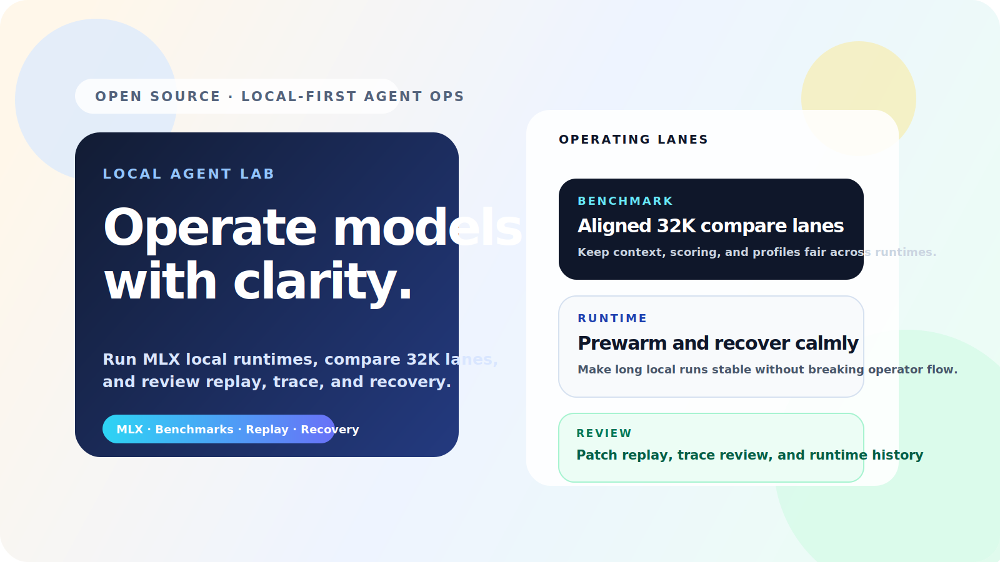

First LLM Studio 是一个面向 Apple Silicon 的本地优先 LLM 工作台。它把本地 MLX 运行时、远端 API 目标、Agent 会话、Compare 对比、Fine-tune 微调、Benchmark 评测、模型发现、runtime 恢复、发布证据和后台监控统一到一个产品界面里。

它不是另一个聊天壳，而是给真正需要比较模型行为、调试 runtime、跑评测、准备 adapter，并把本地/远端模型工作流收在同一个产品循环里的开发者使用。

## 产品入口

| 路由 | 核心工作流 |
| --- | --- |
| `/agent` | 带工具循环的 Agent 会话、target 选择、runtime 状态、replay、trace review，以及内嵌 Compare 入口。 |
| `/compare` | 前台 Compare Studio，负责 prompt 编排、lane preview、recipe 持久化、review drawer 和 benchmark handoff。 |
| `/fine-tune` | 前台 Fine-tune Studio，覆盖数据集、配方、训练、评估、adapter proof loop、导出、报告和 artifacts。 |
| `/models` | 本地/社区模型发现、安装验证、硬件适配和风险提示。 |
| `/benchmarks` | Benchmark run controls、进度、报告、发布证据、baseline 和回归审阅。 |
| `/admin` | Runtime、队列、benchmark 历史、provider health、guardrails 和 audit timeline 的监控/配置镜像。 |

## 大版本核心功能

| 版本 | 核心功能 |
| --- | --- |
| `v0.1` 基础版 | 建立本地优先 Web Studio、Apple Silicon/MLX 网关工作流、本地 + 远端 target catalog、runtime telemetry，以及 Agent/Admin 的第一版操作分层。 |
| `v0.2` Agent + Benchmark 运维 | 增强 Agent 工作台、Compare 式 target review、replay/trace 检查、runtime recovery controls、正式 benchmark 运维、baseline 和回归证据。 |
| `v0.3` Fine-tune + 发布证据 | 加入 evaluation、adapter chat、adapter export、distillation starter 等 fine-tune 操作循环；扩展 operation history、分区 typecheck、截图 smoke、route smoke 和公开发布素材。 |
| `v0.4` 当前源码 checkpoint | 把 `/fine-tune`、`/compare`、`/models`、`/benchmarks` 推进为前台产品路由；迁移 feature-owned state/actions；统一 dark-glass studio/workbench 视觉；API route 变薄 application wrapper；GitHub/ModelScope 同步包；Admin 收口为监控/配置。 |
| `v0.4.1` 稳定基线 | 修复 dataless 工作区导致的启动/编译卡死，保持 route smoke 和 typecheck 通过，刷新 OpenAI-compatible `/v1` 接口、provider 状态回报和当前实机 UI 证据。 |
| `v0.4.2` 证据补丁 | 正式固化 GitHub/ModelScope 高清截图同步、README 截图 LFS 阈值修复，并保留 v0.4.1 真实 LoRA 发布证据作为稳定公开基线。 |
| `v0.5` Starter 轨道 | 企业 RAG、部署 registry、OpenAI-compatible API、telemetry、release-readiness gates、生产签收和 control-plane rehearsal 持续放在显式 preview gate 后推进，满足证据门槛后再 promotion。 |
| `v1.0` 一体化 GA 基线 | 统一 Agent、Compare、Model Hub、Retrieval、Fine-tune、Benchmark、Experiments、Admin 监控、thin application API、route ownership、release security 与可复现证据契约。 |
| `v1.1.0-rc.1` 桌面首次启动 | 加入自包含 Apple Silicon app、内置 Node、ZIP/DMG、首次诊断、权限与服务恢复、迁移/更新/回滚/卸载演练、真实 Ollama 本地对话证明和 clean-profile 启动证据；Developer ID notarization 继续作为独立 GA 门禁。 |
| `v1.1.0-rc.2` 桌面分发门禁 | 将 shell 入口替换为原生 arm64 launcher，并加入内部代码/app/DMG 分层签名、双层公证日志、staple/Gatekeeper 验证、独立 Mac 验收脚本及带线下信任锚的 RSA 组织签收；真实外部 receipt 仍是 GA 门禁。 |
| `v1.1.1` Model Hub 生命周期 | 加入不可变多文件 Hub manifest、provider SHA-256 receipt、operator-approved 物理外置盘迁移、ownership manifest 和可视 promotion read model；更新后的 Hub identity receipt 仍是独立门禁。 |
| `v1.2.0` Local Server 验收 | 加入真实 Ollama 15-slice 验收，覆盖进程健康、模型驻留、OpenAI-compatible chat/SSE、并发、计量、访问策略、日志保留、idle eviction 和 unload/reload recovery；跨设备 LAN 与持续 daemon 证据继续作为生产门禁。 |
| `v1.2.1` Runtime Fabric | 用同一标准化合同实现 MLX、Ollama、llama.cpp、LocalAI、vLLM 与 SGLang 适配器；Apple Silicon 上真实 MLX/Ollama/llama.cpp chat 与 SSE 全部通过，硬件或端点不满足时会在执行前给出可操作错误码；外部 LocalAI、Linux/NVIDIA 与异构节点 receipt 继续作为生产门禁。 |
| `v1.3.0` MCP + 安全扩展 | 加入固定版本 MCP server registry、真实 stdio capability discovery、Ed25519 签名安装/升级/回滚、权限与密钥 scope、quarantine、依赖/路径防御及 macOS Seatbelt 强制隔离；本地验收 11/11 PASS，独立 publisher、Linux/Windows sandbox 与远程 OAuth receipt 继续作为生产门禁。 |

当前已打标签版本见 [`VERSION`](./VERSION)。源码树可能包含下一轮 route-owned 重构 checkpoint，正式标签会在后续发布时推进。

最新发布候选说明：[`v1.1.0-rc.2`](./docs/releases/v1.1.0-rc.2_2026-07-16.md)。生产分发链已可执行并保持 fail-closed；仓库不会把缺失的 Apple 或组织 receipt 表述为已完成证据。

## 竞品定位对比

本表基于 2026-07-12 可查的官方产品文档。**核心**表示产品原生主流程，**已集成**表示具备能力但不是最深的专长，**生态**表示通常依赖相邻客户端或插件组装。“非主线”不等于技术上完全不能实现。

| 产品 | 最强定位 | 本地运行时 / Model Hub | Agent / RAG | Fine-tune / LoRA | 评测 / 运维证据 |
| --- | --- | --- | --- | --- | --- |
| **First LLM Studio** | 证据驱动的本地模型全生命周期 | **核心**，MLX 与硬件感知 | **核心**，工具 + Compare + ACL/引用 | **核心**，从 recipe、最佳 checkpoint 到 adapter lifecycle | **核心**，Benchmark、lineage 与 fail-closed 发布门槛 |
| [LM Studio](https://lmstudio.ai/docs/developer/core/server) | 成熟的桌面模型发现和本地服务 | **核心**，GUI/CLI 加载、下载、卸载和兼容 API | **已集成**，API、工具和 MCP | 非主线 | Runtime / Developer 检查 |
| [Ollama](https://docs.ollama.com/api/introduction) | 简洁稳定的模型运行时与打包 | **核心**，本地 API 与模型生命周期 | **生态**，原生支持 tool calling | 非主线 | 生态提供 |
| [Open WebUI](https://docs.openwebui.com/features/) | 面向团队的自托管 AI 工作区 | **已集成**，多 provider | **核心**，混合 RAG、reranker、工具和 MCP | 非主线 | **已集成**，Arena/A-B/ELO、分析和 OTel |
| [Jan](https://www.jan.ai/docs/desktop/api-server) | 开源跨平台桌面助手 | **核心**，llama.cpp/MLX 与可配置 Local Server | **已集成**，Agent/Project/MCP | 非主线 | Server 日志与开发检查 |
| [AnythingLLM](https://docs.anythingllm.com/) | Workspace RAG 与 Agent 自动化 | **已集成**，多 provider | **核心**，Workspace、Flow、Skill 和定时任务 | 非主线 | 日志与 Flow Run |
| [LLaMA-Factory](https://github.com/hiyouga/LlamaFactory) | 高效训练的模型/方法覆盖深度 | 训练与推理工具 | 面向任务的工具调用训练 | **核心**，广泛 LoRA/QLoRA 与偏好训练 | **核心**，训练监控与 benchmark 集成 |
| [LocalAI](https://localai.io/) | 模块化、多后端的私有 AI runtime | **核心**，广硬件/后端和分布式 worker | **核心**，Agent/MCP/RAG/引用 | **已集成** | Runtime 与控制面运维 |

First LLM Studio 的优势是把 Agent、Compare、Retrieval、Benchmark、Fine-tune、adapter export、Workflow Studio 和 release review 接成一条证据链。当前最明确的剩余短板是签名桌面分发、异构 runtime 生产证据、团队身份与治理、协同/分布式 workflow 执行，以及真实多节点/云生产证据。完整方法、优劣势、官方来源和 post-v1 借鉴原则见双语文档：[竞品格局与产品方向](./docs/competitive-landscape.md)。

## 对哪些用户有价值

### Apple Silicon 本地 AI 开发者

- 在统一上下文预算下，对比 MLX 本地模型和托管 API。
- 不离开应用就能查看 runtime 成本、prewarm、release、恢复动作和硬件压力。
- 判断哪个本地模型真的适合日常 coding / analysis 工作流。

### Agent / 工具链团队

- 在一个工作台里验证 tool calling、repo-grounded behavior、replay 和 patch 流程。
- 直接把 Compare 结果送入 Benchmark，不必切换产品。
- 区分失败来源：模型质量、provider 行为，还是本地 runtime 不稳。

### 评测 / 平台工程团队

- 用可复现 profile 跑 formal 和 focused benchmark suites。
- 查看 baseline、delta、run note、失败分类和发布证据。
- 让本地与远端 target 落在同一个可比较的 target catalog 里。

## 核心价值

- 本地 + 远端统一 target catalog。
- Compare Lab 支持模型对模型审阅。
- Fine-tune 工作流覆盖 dataset、recipe、training、evaluation、adapter proof loop 和 export。
- 可视化 Workflow Studio 覆盖 Agent/RAG/eval 类型图、不可变 recipe、受保护工具执行、回放与 OpenAI-compatible 部署。
- Benchmark 运维覆盖 history、progress、baseline、report 和 release evidence。
- Replay、trace review、patch inspection 与可导出的审阅记录。
- Runtime 运维覆盖 prewarm、release、restart、日志检查、telemetry 和 recovery。
- 支持本地/社区模型发现和远端 provider health 扫描。

## 当前支持的 Target

### 本地

- `Local Qwen3 0.6B`
- `Local Qwen3 4B 4-bit`
- `Local Qwen3.5 4B 4-bit`
- `Local Gemma 3 4B It Qat 4-bit`

### 远端

- `OpenAI Codex`
- `OpenAI GPT-5.5`
- `Claude API`
- `DeepSeek API`
- `Kimi API`
- `GLM API`
- `Qwen API`

Target 选择、稳定性与适用任务对照：[`docs/benchmark-lane-comparison.md`](./docs/benchmark-lane-comparison.md)。

贡献者入口：[English](./CONTRIBUTING.md) · [中文快速上手](./docs/chinese-contributor-quickstart.md) · [GitHub 仓库设置清单](./docs/github-repository-setup-checklist.md)。

## 截图

以下截图来自本地运行版本，并已通过 `npm run typecheck` 与 `npm run smoke:routes`。README 截图使用 `npm run screenshots:readme` 以 2x DPR 生成，确保在 GitHub 和 ModelScope 缩放后文字仍然清晰。

Agent 工作台：target catalog、runtime rail 与工具化输入区：

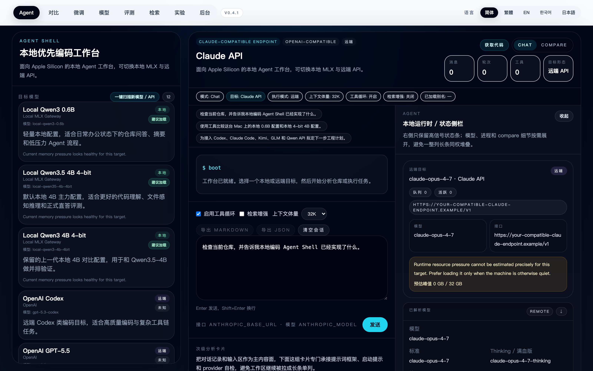

Workflow Graph Studio：可拖拽类型节点、版本/修订控制、执行恢复与 promotion evidence：

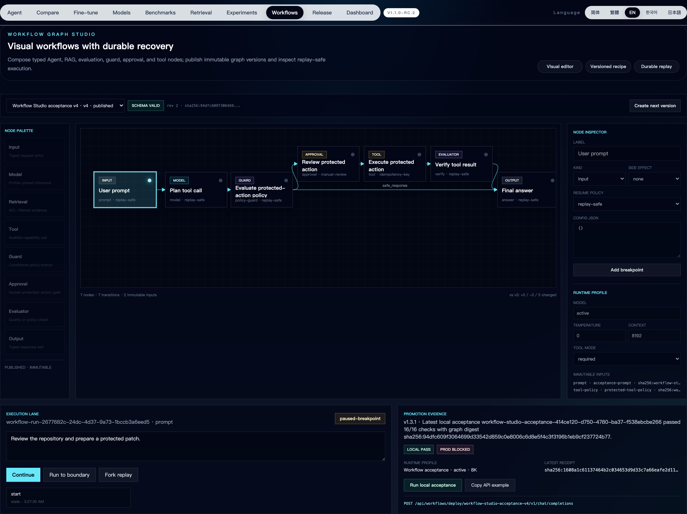

可复现动态演示流程：[`docs/demo-video-workflow.md`](./docs/demo-video-workflow.md)。

[查看 Agent 工作台 MP4 演示](./docs/assets/demo/agent-workbench.mp4) · [SHA-256 元数据](./docs/assets/demo/agent-workbench.mp4.metadata.json)

Fine-tune Studio：工作流 tab、训练控制与 report/evidence 面板：

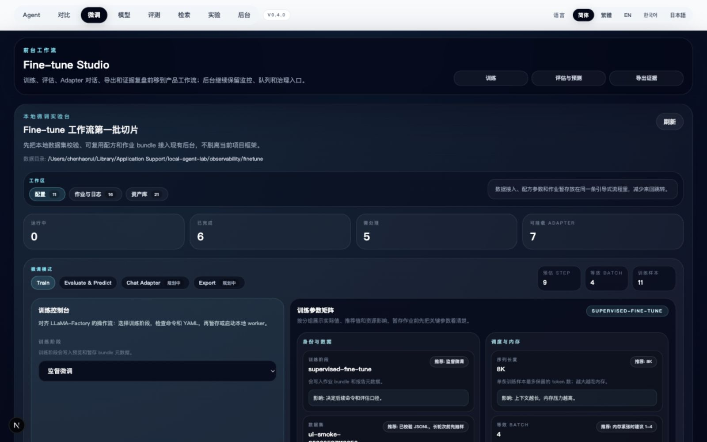

Fine-tune 完成作业：真实 loss 曲线、训练/验证轨迹与 handoff 操作：

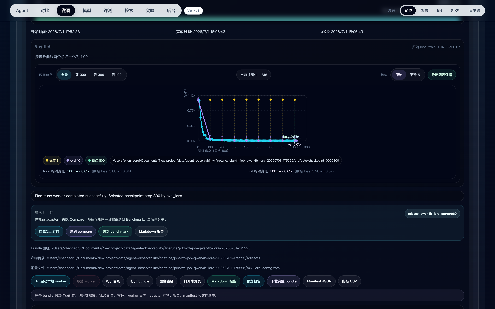

Benchmark Studio：运行控制与历史证据卡片：

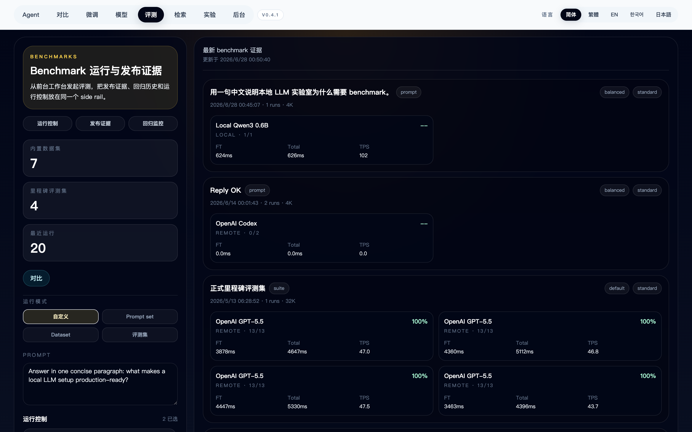

Benchmark：本地 smoke run 生成的真实评测证据：


Models Studio：不可变 Hub/外置盘证据、真实 Ollama Local Server 验收，以及真实 MLX/Ollama/llama.cpp Runtime Fabric 矩阵：

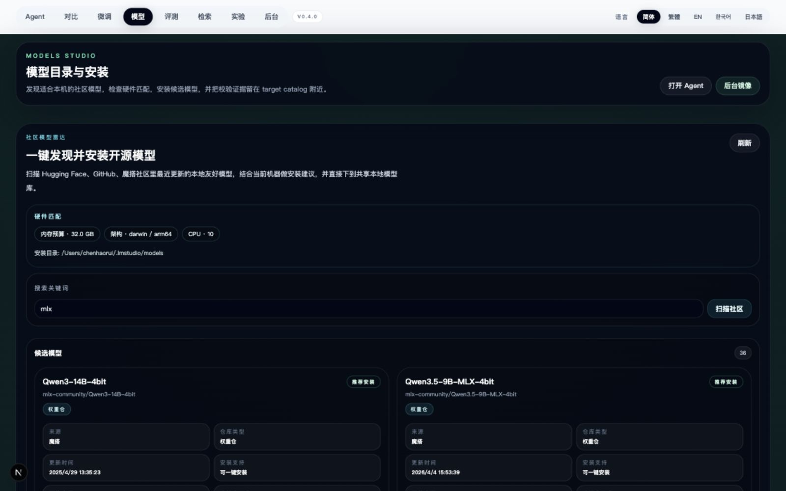

MCP 与安全扩展验收：签名生命周期、真实工具发现、隔离/检疫防御和显式生产门禁：

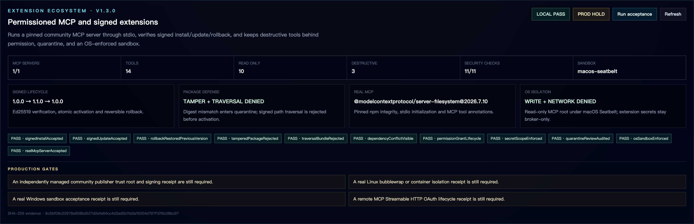

Compare、Retrieval 与 Admin：

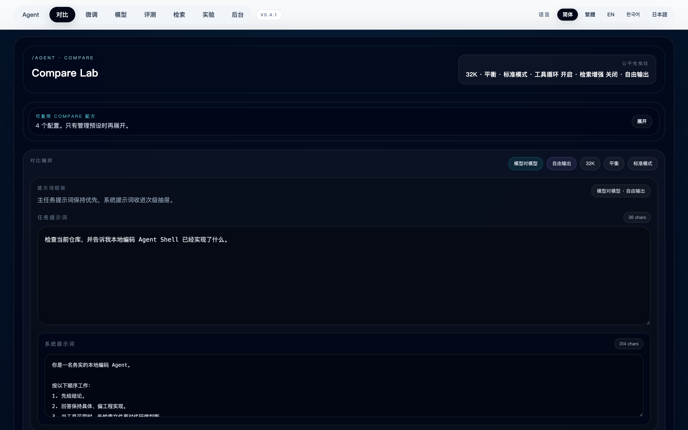
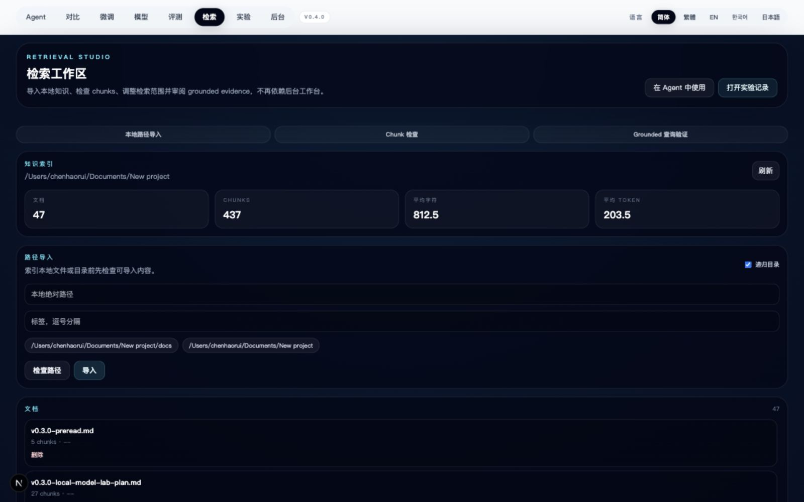
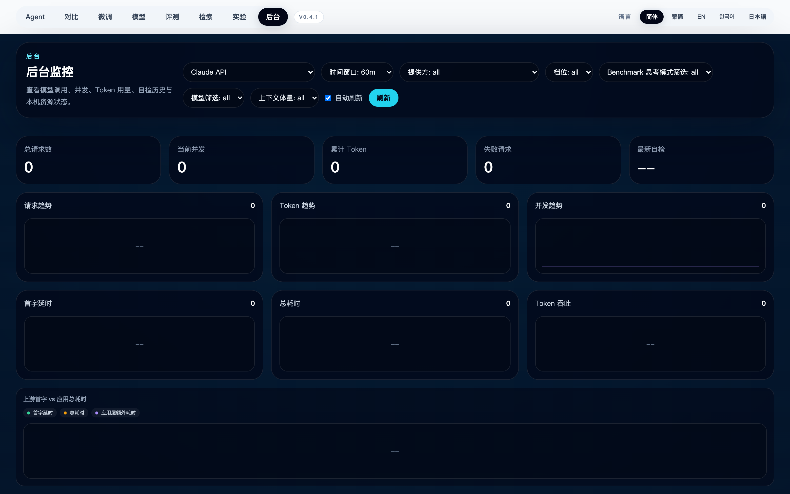
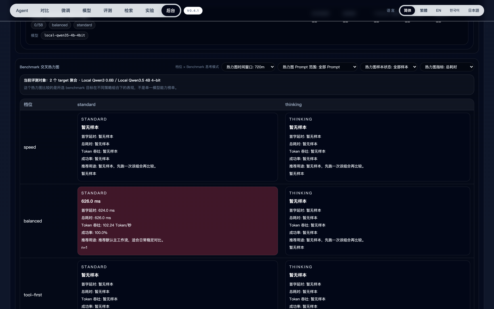

## 快速开始

### 环境要求

- Apple Silicon macOS
- Node `22.x`
- Python `3.12`
- 可运行 MLX 的本地环境

### 安装

```bash
nvm install 22
nvm use 22
npm install
cp .env.example .env.local
```

### 启动 Web 应用

```bash
npm run dev
```

默认入口：

- [http://localhost:3011/agent](http://localhost:3011/agent)
- [http://localhost:3011/compare](http://localhost:3011/compare)
- [http://localhost:3011/fine-tune](http://localhost:3011/fine-tune)
- [http://localhost:3011/models](http://localhost:3011/models)
- [http://localhost:3011/benchmarks](http://localhost:3011/benchmarks)
- [http://localhost:3011/admin](http://localhost:3011/admin)

### 启动本地模型网关

```bash
python3.12 -m venv .venv
source .venv/bin/activate
pip install -U pip
pip install mlx mlx-lm
python scripts/local_model_gateway_supervisor.py
```

网关健康检查：

- [http://127.0.0.1:4000/health](http://127.0.0.1:4000/health)

## 验证

```bash
npm run typecheck:changed
npm run smoke:routes
npm run smoke:screenshots
```

## 发布与同步

- GitHub: [https://github.com/ChrisChen667788/local-agent-lab](https://github.com/ChrisChen667788/local-agent-lab)
- ModelScope profile: [https://www.modelscope.cn/profile/haozi667788](https://www.modelscope.cn/profile/haozi667788)
- 默认 ModelScope repo id: `haozi667788/first-llm-studio`

ModelScope 打包脚本会导出已提交的 Git tree，因此每次同步都可以让 GitHub 和 ModelScope 保持同一份文件快照。

## 安全和隐私

- 敏感本地操作默认需要确认。
- Secret 应保存在 `.env.local`。
- 公开仓库默认配置已经做过脱敏。
- 见 [SECURITY.md](./SECURITY.md)。

## 发布说明

- 当前版本：[`VERSION`](./VERSION)
- Release notes：[`docs/releases`](./docs/releases)
- 发布流程：[`docs/release-process.md`](./docs/release-process.md)
- 最新版本说明：[v1.1.0-rc.2](./docs/releases/v1.1.0-rc.2_2026-07-16.md)
