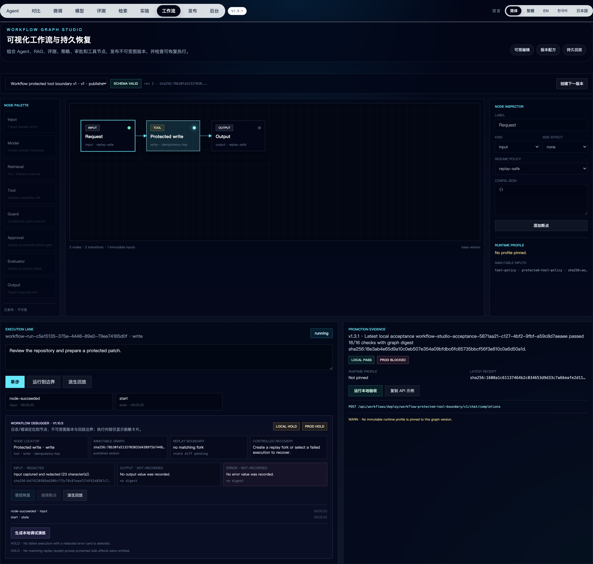
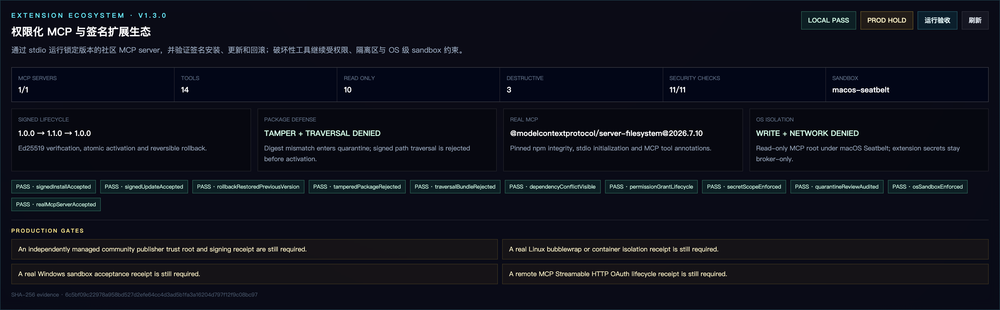
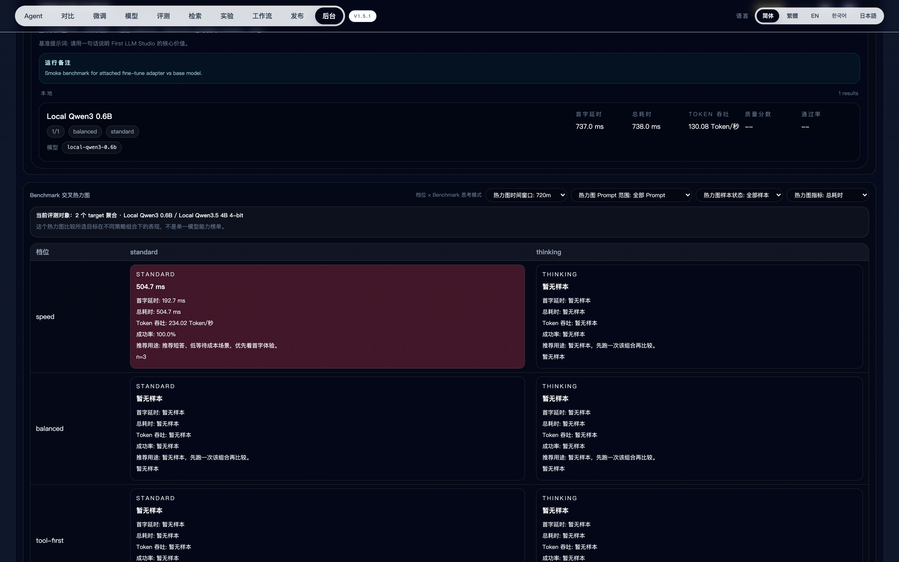

# First LLM Studio

[English + 简体中文 README](./README.md)


First LLM Studio 是一个面向 Apple Silicon 的本地优先 LLM 工作台。它把本地 MLX 运行时、远端 API 目标、Agent 会话、Compare 对比、Fine-tune 微调、Benchmark 评测、模型发现、runtime 恢复、发布证据和后台监控统一到一个产品界面里。

它不是另一个聊天壳，而是给真正需要比较模型行为、调试 runtime、跑评测、准备 adapter，并把本地/远端模型工作流收在同一个产品循环里的开发者使用。

## 产品入口

| 路由 | 核心工作流 |
| --- | --- |
| `/agent` | 带工具循环的 Agent 会话、target 选择、runtime 状态、replay、trace review，以及内嵌 Compare 入口。 |
| `/compare` | 前台 Compare Studio，负责 prompt 编排、lane preview、recipe 持久化、review drawer 和 benchmark handoff。 |
| `/fine-tune` | 前台 Fine-tune Studio，覆盖数据集、配方、训练、评估、adapter proof loop、导出、报告和 artifacts。 |
| `/models` | 本地/社区模型发现、安装验证、硬件适配和风险提示。 |
| `/benchmarks` | Benchmark run controls、进度、报告、发布证据、baseline 和回归审阅。 |
| `/admin` | Runtime、队列、benchmark 历史、provider health、guardrails 和 audit timeline 的监控/配置镜像。 |

## 大版本核心功能

| 版本 | 核心功能 |
| --- | --- |
| `v0.1` 基础版 | 建立本地优先 Web Studio、Apple Silicon/MLX 网关工作流、本地 + 远端 target catalog、runtime telemetry，以及 Agent/Admin 的第一版操作分层。 |
| `v0.2` Agent + Benchmark 运维 | 增强 Agent 工作台、Compare 式 target review、replay/trace 检查、runtime recovery controls、正式 benchmark 运维、baseline 和回归证据。 |
| `v0.3` Fine-tune + 发布证据 | 加入 evaluation、adapter chat、adapter export、distillation starter 等 fine-tune 操作循环；扩展 operation history、分区 typecheck、截图 smoke、route smoke 和公开发布素材。 |
| `v0.4` 当前源码 checkpoint | 把 `/fine-tune`、`/compare`、`/models`、`/benchmarks` 推进为前台产品路由；迁移 feature-owned state/actions；统一 dark-glass studio/workbench 视觉；API route 变薄 application wrapper；GitHub/ModelScope 同步包；Admin 收口为监控/配置。 |
| `v0.4.1` 稳定基线 | 修复 dataless 工作区导致的启动/编译卡死，保持 route smoke 和 typecheck 通过，刷新 OpenAI-compatible `/v1` 接口、provider 状态回报和当前实机 UI 证据。 |
| `v0.4.2` 证据补丁 | 正式固化 GitHub/ModelScope 高清截图同步、README 截图 LFS 阈值修复，并保留 v0.4.1 真实 LoRA 发布证据作为稳定公开基线。 |
| `v0.5` Starter 轨道 | 企业 RAG、部署 registry、OpenAI-compatible API、telemetry、release-readiness gates、生产签收和 control-plane rehearsal 持续放在显式 preview gate 后推进，满足证据门槛后再 promotion。 |
| `v1.0` 一体化 GA 基线 | 统一 Agent、Compare、Model Hub、Retrieval、Fine-tune、Benchmark、Experiments、Admin 监控、thin application API、route ownership、release security 与可复现证据契约。 |
| `v1.1.0-rc.1` 桌面首次启动 | 加入自包含 Apple Silicon app、内置 Node、ZIP/DMG、首次诊断、权限与服务恢复、迁移/更新/回滚/卸载演练、真实 Ollama 本地对话证明和 clean-profile 启动证据；Developer ID notarization 继续作为独立 GA 门禁。 |
| `v1.1.0-rc.2` 桌面分发门禁 | 将 shell 入口替换为原生 arm64 launcher，并加入内部代码/app/DMG 分层签名、双层公证日志、staple/Gatekeeper 验证、独立 Mac 验收脚本及带线下信任锚的 RSA 组织签收；真实外部 receipt 仍是 GA 门禁。 |
| `v1.1.1` Model Hub 生命周期 | 加入不可变多文件 Hub manifest、provider SHA-256 receipt、operator-approved 物理外置盘迁移、ownership manifest 和可视 promotion read model；更新后的 Hub identity receipt 仍是独立门禁。 |
| `v1.2.0` Local Server 验收 | 加入真实 Ollama 15-slice 验收，覆盖进程健康、模型驻留、OpenAI-compatible chat/SSE、并发、计量、访问策略、日志保留、idle eviction 和 unload/reload recovery；跨设备 LAN 与持续 daemon 证据继续作为生产门禁。 |
| `v1.2.1` Runtime Fabric | 用同一标准化合同实现 MLX、Ollama、llama.cpp、LocalAI、vLLM 与 SGLang 适配器；Apple Silicon 上真实 MLX/Ollama/llama.cpp chat 与 SSE 全部通过，硬件或端点不满足时会在执行前给出可操作错误码；外部 LocalAI、Linux/NVIDIA 与异构节点 receipt 继续作为生产门禁。 |
| `v1.3.0` MCP + 安全扩展 | 加入固定版本 MCP server registry、真实 stdio capability discovery、Ed25519 签名安装/升级/回滚、权限与密钥 scope、quarantine、依赖/路径防御及 macOS Seatbelt 强制隔离；本地验收 11/11 PASS，独立 publisher、Linux/Windows sandbox 与远程 OAuth receipt 继续作为生产门禁。 |
| `v2.1.x` Post-GA 运维证据 | 加入连续性、SLO、事故、数据、访问、供应链、质量、容量、灾备和独立复核的只读外部签名链；只能验证，不能操作或授权生产。 |
| `v2.2.x` 持续 Assurance | 加入合规范围、隐私、模型风险、第三方、监管映射、透明度、Responsible UX、资源效率、整改和独立复核的严格外部签名合同。 |
| `v2.3.0-v2.3.4` Assurance 闭环 | 加入证据迁移回读、Trust Center 发布、持续监控、独立审计整改和不可变闭环归档验证；外部证据保持 `HOLD`，生产保持 `BLOCKED`。 |
| `v2.4.0-v2.5.4` 运行与部署生命周期 | 把 Runtime、Provider、成本、Benchmark、Retrieval、Agent、Workflow、Fine-tune 与部署可移植性、主权、密钥、连续性连接成 source-backed 证据链。 |
| `v2.6.0-v2.7.4` 受治理自治与开放互操作 | 覆盖模型选择、Provider 路由、Grounded Context、工具权限、受保护动作、质量、Adapter 回滚、OpenAI-compatible、MCP、产物与身份可移植性。 |
| `v2.8.0-v2.8.9` 运行整改与效率 | 把 Provider、Retrieval、模型供应链、Workspace 审计、Runtime、Agent、Workflow、Benchmark 与 Fine-tune 的真实 owner 信号整理为有优先级的整改链。 |
| `v2.9.0-v2.9.4` 可持续运行与升级 | 增加遥测/资源透明度、故障诊断与保留、Admin compatibility sunset、桌面升级/数据生命周期及独立闭环。 |
| `v3.0.0-v3.0.9` 整改控制面 | 把 7 个未闭环 owner 信号转换为带优先级、依赖、验收条件、下一动作、证据指纹、确定性打包与独立签收的控制项。 |
| `v3.1.0-v3.1.4` 服务就绪 | 增加客户安全的就绪披露、支持诊断、升级变更连续性、运行交接看板和独立闭环，同时保持生产授权独立。 |
| `v3.2.0-v3.2.9` 整改执行 | 把 7 个 owner 控制项转换为带确定性幂等、短租约、围栏、回滚、证据打包和独立执行签收的非变更执行计划。 |
| `v3.3.0-v3.3.4` 运营验收 | 增加 SLO/质量策略、事故/变更演练、身份绑定 owner 签收、显式发布决策和前序绑定的独立运营验收。 |
| `v3.4.0-v3.4.9` Owner 工作负载准入 | 为 7 类 owner 工作负载增加严格摘要绑定请求、只读准入、受限 SLA/升级、候选回执校验和独立回执闭环。 |
| `v3.5.0-v3.5.4` 运营决策治理 | 增加证据时效/漂移、依赖解锁影响、owner SLA、不可续期的限时豁免和独立决策闭环。 |
| `v3.6.0-v3.6.9` Owner 回执生命周期 | 增加带鉴权的候选回执接收、仅摘要隔离、乐观并发、补偿绑定与独立账本闭环。 |
| `v3.7.0-v3.7.4` 运营异常治理 | 增加 SLA 超时检测、确认事件、受保护 scope 的豁免到期、决策包与独立异常闭环。 |
| `v3.8.0-v3.8.9` 竞品模型与 Agent 产品列车 | **计划中：** 官方来源注册表、能力探测、可解释路由、Agent conformance/state/cache、隔离式团队、沙箱、多模态 evaluator gate、Model Hub v3 和 Local Server v3。 |
| `v3.9.0-v3.9.4` RAG、训练、团队与 freshness 列车 | **计划中：** connector/index 生命周期、RAG 质量反馈、Fine-tune 后端联邦、Team Studio/marketplace 和不超过 14 天的竞品 promotion gate。 |

当前已打标签版本见 [`VERSION`](./VERSION)。源码树可能包含下一轮 route-owned 重构 checkpoint，正式标签会在后续发布时推进。

上一阶段运行整改计划见 [`v2.8.0-v2.9.4`](./docs/v2.8.0-v2.9.4-operational-sustainability-plan-2026-08-30.md)。首轮 owner-controlled 投影记录 6 个通过、7 个需关注、0 个不可用和 2 个仅外部可满足的信号；独立外部签收仍为 `0/15`，分发保持 `HOLD`，生产保持 `BLOCKED`。

上一阶段已验证 source gate 见 [`v2.8.0-v2.9.4`](./docs/release-evidence/v2.8.0-v2.9.4-operational-sustainability-source-gate-2026-08-30.md)：119/119 测试、73/73 CI 路由、完整 smoke 与桌面/移动浏览器验证均通过。

上一阶段整改控制与服务就绪计划见 [`v3.0.0-v3.1.4`](./docs/v3.0.0-v3.1.4-remediation-service-readiness-plan-2026-08-30.md)：首轮投影为 5 个通过、8 个需关注、0 个不可用和 2 个仅外部可满足；控制面分类为 2 个 satisfied、3 个 open、8 个 blocked、2 个 external-only。独立签收仍为 `0/15`，生产保持 `BLOCKED`。

上一阶段已验证 source gate 见 [`v3.0.0-v3.1.4`](./docs/release-evidence/v3.0.0-v3.1.4-remediation-service-readiness-source-gate-2026-08-30.md)：125/125 测试、75/75 CI 路由、完整 smoke、生产构建、安全预检及桌面/移动浏览器验证均通过。

最新整改执行与运营验收计划见 [`v3.2.0-v3.3.4`](./docs/v3.2.0-v3.3.4-remediation-execution-operational-acceptance-plan-2026-08-30.md)：7 个直接 owner 动作具备确定性幂等键、短租约、围栏、回滚和证据指纹；当前为 0 个 satisfied、3 个 ready、4 个 blocked。独立签收仍为 `0/15`，生产保持 `BLOCKED`。

最新已验证 source gate 见 [`v3.2.0-v3.3.4`](./docs/release-evidence/v3.2.0-v3.3.4-remediation-execution-operational-acceptance-source-gate-2026-08-30.md)：131/131 测试、77/77 CI 路由、完整 smoke、生产构建、安全预检及桌面/移动浏览器验证均通过；本地运营状态继续保持 `ATTENTION`，生产保持 `BLOCKED`。

当前 Owner 工作负载与运营决策计划见 [`v3.4.0-v3.5.4`](./docs/v3.4.0-v3.5.4-owner-workload-operational-decision-plan-2026-08-30.md)：7 类 owner 工作负载现已具备严格请求与候选回执合同；源码投影为 5 个通过、8 个需关注和 2 个仅外部可满足。外部证据仍为 `0/15`，分发保持 `HOLD`，生产保持 `BLOCKED`。

当前已验证 source gate 见 [`v3.4.0-v3.5.4`](./docs/release-evidence/v3.4.0-v3.5.4-owner-workload-operational-decision-source-gate-2026-08-30.md)：137/137 测试、全部 11 个变更 TypeScript 分区、79/79 CI 路由、完整 smoke、生产构建、安全预检及桌面/移动浏览器验证均通过，同时保持 `ATTENTION`/`HOLD`/`BLOCKED` 事实边界。

当前回执与异常生命周期计划见 [`v3.6.0-v3.7.4`](./docs/v3.6.0-v3.7.4-owner-receipt-exception-lifecycle-plan-2026-08-30.md)：仓库已实现带鉴权的 append-only 回执事件、隔离、补偿、升级确认、限时豁免到期和确定性决策包。源码投影为 6 个通过、7 个需关注、2 个仅外部可满足；本轮未提交真实 owner 回执，外部证据仍为 `0/15`，分发保持 `HOLD`，生产保持 `BLOCKED`。

最新发布候选说明：[`v1.1.0-rc.2`](./docs/releases/v1.1.0-rc.2_2026-07-16.md)。生产分发链已可执行并保持 fail-closed；仓库不会把缺失的 Apple 或组织 receipt 表述为已完成证据。

## 竞品定位对比

本表基于 2026-08-31 可查的官方产品与模型文档。**核心**表示产品原生主流程，**已集成**表示具备能力但不是最深的专长，**生态**表示通常依赖相邻客户端或插件组装。厂商自报 benchmark 不直接算作本项目证据。

| 产品 | 最强定位 | 本地运行时 / Model Hub | Agent / RAG | Fine-tune / LoRA | 评测 / 运维证据 |
| --- | --- | --- | --- | --- | --- |
| **First LLM Studio** | 证据驱动的本地模型全生命周期 | **核心**，MLX 与硬件感知 | **核心**，工具 + Compare + ACL/引用 | **核心**，从 recipe、最佳 checkpoint 到 adapter lifecycle | **核心**，Benchmark、lineage 与 fail-closed 发布门槛 |
| [LM Studio](https://lmstudio.ai/docs/developer/core/server) | 成熟的桌面模型发现和本地服务 | **核心**，GUI/CLI 加载、下载、卸载和兼容 API | **已集成**，API、工具和 MCP | 非主线 | Runtime / Developer 检查 |
| [Ollama](https://docs.ollama.com/api/introduction) | 简洁稳定的模型运行时与打包 | **核心**，本地 API 与模型生命周期 | **生态**，原生支持 tool calling | 非主线 | 生态提供 |
| [Open WebUI](https://docs.openwebui.com/features/) | 面向团队的自托管 AI 工作区 | **已集成**，多 provider | **核心**，混合 RAG、reranker、工具和 MCP | 非主线 | **已集成**，Arena/A-B/ELO、分析和 OTel |
| [Jan](https://www.jan.ai/docs/desktop/api-server) | 开源跨平台桌面助手 | **核心**，llama.cpp/MLX 与可配置 Local Server | **已集成**，Agent/Project/MCP | 非主线 | Server 日志与开发检查 |
| [AnythingLLM](https://docs.anythingllm.com/) | Workspace RAG 与 Agent 自动化 | **已集成**，多 provider | **核心**，Workspace、Flow、Skill 和定时任务 | 非主线 | 日志与 Flow Run |
| [Dify](https://docs.dify.ai/en/develop-plugin/getting-started/choose-plugin-type) | 可视化 AI 应用与 workflow 交付 | **已集成**，provider/plugin catalog | **核心**，Workflow、Agent Strategy、Knowledge 与 datasource plugin | 非主线 | 应用与运行检查 |
| [LLaMA-Factory](https://github.com/hiyouga/LlamaFactory) | 高效训练的模型/方法覆盖深度 | 训练与推理工具 | 面向任务的工具调用训练 | **核心**，广泛 LoRA/QLoRA 与偏好训练 | **核心**，训练监控与 benchmark 集成 |
| [ModelScope SWIFT](https://swift.readthedocs.io/en/v3.7/Instruction/Evaluation.html) | 国内模型训练与多模态评测广度 | 多后端训练/推理 | 面向任务 | **核心**，训练与多模态方法 | **核心**，EvalScope/OpenCompass/VLMEvalKit 适配 |
| [LocalAI](https://localai.io/) | 模块化、多后端的私有 AI runtime | **核心**，广硬件/后端和分布式 worker | **核心**，Agent/MCP/RAG/引用 | **已集成** | Runtime 与控制面运维 |

当前官方模型/Agent 雷达包括 OpenAI `gpt-5.6-sol`、Anthropic `claude-fable-5` / `claude-opus-5` 与 Managed Agents、Google `gemini-3.7-flash` 与 Antigravity、DeepSeek V4、MiniMax M2.7、Kimi K2.6、智谱 `glm-5.2` 以及 Qwen3-Coder / Qwen Code Agent Team。它只是 provider 集成雷达，不代表本机已配置或已购买全部模型。

First LLM Studio 的优势是统一证据链；最紧急短板是 provider 型号漂移、Agent 长任务/多 Agent/沙箱、Local Server 产品化、RAG connector/index 运维、训练后端广度和真实多用户/生产证据。最新版已把这些差距细化为 `v3.8.0-v3.9.4` 15 个 `planned` 版本，并加入不超过 14 天的竞品 freshness gate。完整方法、优劣势、官方来源和版本顺序见：[竞品格局与产品方向](./docs/competitive-landscape.md)。

## 对哪些用户有价值

### Apple Silicon 本地 AI 开发者

- 在统一上下文预算下，对比 MLX 本地模型和托管 API。
- 不离开应用就能查看 runtime 成本、prewarm、release、恢复动作和硬件压力。
- 判断哪个本地模型真的适合日常 coding / analysis 工作流。

### Agent / 工具链团队

- 在一个工作台里验证 tool calling、repo-grounded behavior、replay 和 patch 流程。
- 直接把 Compare 结果送入 Benchmark，不必切换产品。
- 区分失败来源：模型质量、provider 行为，还是本地 runtime 不稳。

### 评测 / 平台工程团队

- 用可复现 profile 跑 formal 和 focused benchmark suites。
- 查看 baseline、delta、run note、失败分类和发布证据。
- 让本地与远端 target 落在同一个可比较的 target catalog 里。

## 核心价值

- 本地 + 远端统一 target catalog。
- Compare Lab 支持模型对模型审阅。
- Fine-tune 工作流覆盖 dataset、recipe、training、evaluation、adapter proof loop 和 export。
- 可视化 Workflow Studio 覆盖 Agent/RAG/eval 类型图、不可变 recipe、受保护工具执行、回放与 OpenAI-compatible 部署。
- Benchmark 运维覆盖 history、progress、baseline、report 和 release evidence。
- Replay、trace review、patch inspection 与可导出的审阅记录。
- Runtime 运维覆盖 prewarm、release、restart、日志检查、telemetry 和 recovery。
- 支持本地/社区模型发现和远端 provider health 扫描。

## 当前支持的 Target

### 本地

- `Local Qwen3 0.6B`
- `Local Qwen3 4B 4-bit`
- `Local Qwen3.5 4B 4-bit`
- `Local Gemma 3 4B It Qat 4-bit`

### 远端

- `OpenAI Codex`
- `OpenAI GPT-5.5`
- `Claude API`
- `DeepSeek API`
- `Kimi API`
- `GLM API`
- `Qwen API`

Target 选择、稳定性与适用任务对照：[`docs/benchmark-lane-comparison.md`](./docs/benchmark-lane-comparison.md)。

贡献者入口：[English](./CONTRIBUTING.md) · [中文快速上手](./docs/chinese-contributor-quickstart.md) · [GitHub 仓库设置清单](./docs/github-repository-setup-checklist.md)。

## 最新真机证据

2026-08-30 的证据刷新从当前运行中的应用生成了新一批高清实机材料：

- Runtime Fabric：真实 MLX、Ollama、llama.cpp 3/3 后端通过，adapter contract 6/6，标准化操作 42/42。
- Local Server：真实 Ollama 0.31.1 + Qwen3 0.6B 通过 15/15 项，完成 6 个请求、95 tokens，平均延迟 169 ms。
- Benchmark smoke：Local Qwen3 0.6B 完成 3/3 次运行，首 token 192.67 ms，总延迟 504.67 ms，吞吐 234.02 tokens/s。
- MATH-500：完整 500 题输出全部判分，官方等价判分器决定 500/500 重放一致，本地准确率 32%。
- Fine-tune：真实 Qwen3 4B LoRA 归档保留 816 steps、save/eval 事件和 step 800 最佳 checkpoint。

完整指标、摘要、截图尺寸与证据边界见：[`v3.1.4-high-resolution-live-machine-capture-2026-08-30.md`](./docs/release-evidence/v3.1.4-high-resolution-live-machine-capture-2026-08-30.md)。已通过的项目仅代表本地源码/实机验收；缺少独立外部证据的生产晋级继续保持 `HOLD` 或 `BLOCKED`。

## 截图

以下截图来自本地运行版本，并经过类型、测试、构建、路由与截图完整性验证。1920x1200 截图视口使用 2x DPR，路由图达到 3840x2400；证据面板保留原生高清裁切，LoRA 图从 SVG 以 2x DPR 导出。

Agent 工作台：target catalog、runtime rail 与工具化输入区：


Workflow Graph Studio：可拖拽类型节点、版本/修订控制、执行恢复与 promotion evidence：



可复现动态演示流程：[`docs/demo-video-workflow.md`](./docs/demo-video-workflow.md)。

[查看 Agent 工作台 MP4 演示](./docs/assets/demo/agent-workbench.mp4) · [SHA-256 元数据](./docs/assets/demo/agent-workbench.mp4.metadata.json)

Fine-tune Studio：工作流 tab、训练控制与 report/evidence 面板：


Fine-tune 完成作业：真实 loss 曲线、训练/验证轨迹与 handoff 操作：


真实 Qwen3 4B LoRA 发布证据：包含 save/eval 事件标记和自动选择的最佳 checkpoint：


矢量版本：[`fine-tune-qwen4b-lora-chart.svg`](./docs/assets/screenshots/fine-tune-qwen4b-lora-chart.svg)。完整 run archive 与 manifest：[`docs/release-evidence/finetune-qwen4b-lora-2026-07-01`](./docs/release-evidence/finetune-qwen4b-lora-2026-07-01)。

Benchmark Studio：运行控制与历史证据卡片：


Benchmark：本轮本地实机 smoke run 生成的评测证据：


完整 MATH-500 结果：学科/难度分层、Wilson 置信区间、判分器重放、延迟与 token 性能：


Models Studio：不可变 Hub/外置盘证据、真实 Ollama Local Server 验收，以及真实 MLX/Ollama/llama.cpp Runtime Fabric 矩阵：


本轮真实 Runtime Fabric 与 Local Server 验收面板：


MCP 与安全扩展验收：签名生命周期、真实工具发现、隔离/检疫防御和显式生产门禁：



Compare、Retrieval 与 Admin：




运行整改与服务就绪控制面板，尚未完成的外部门禁保持可见：


## 快速开始

### 环境要求

- Apple Silicon macOS
- Node `22.x`
- Python `3.12`
- 可运行 MLX 的本地环境

### 安装

```bash
nvm install 22
nvm use 22
npm install
cp .env.example .env.local
```

### 启动 Web 应用

```bash
npm run dev
```

默认入口：

- [http://localhost:3011/agent](http://localhost:3011/agent)
- [http://localhost:3011/compare](http://localhost:3011/compare)
- [http://localhost:3011/fine-tune](http://localhost:3011/fine-tune)
- [http://localhost:3011/models](http://localhost:3011/models)
- [http://localhost:3011/benchmarks](http://localhost:3011/benchmarks)
- [http://localhost:3011/admin](http://localhost:3011/admin)

### 启动本地模型网关

```bash
python3.12 -m venv .venv
source .venv/bin/activate
pip install -U pip
pip install mlx mlx-lm
python scripts/local_model_gateway_supervisor.py
```

网关健康检查：

- [http://127.0.0.1:4000/health](http://127.0.0.1:4000/health)

## 验证

```bash
npm run typecheck:changed
npm run smoke:routes
npm run smoke:screenshots
```

## 发布与同步

- GitHub: [https://github.com/ChrisChen667788/local-agent-lab](https://github.com/ChrisChen667788/local-agent-lab)
- ModelScope profile: [https://www.modelscope.cn/profile/haozi667788](https://www.modelscope.cn/profile/haozi667788)
- 默认 ModelScope repo id: `haozi667788/first-llm-studio`

ModelScope 打包脚本会导出已提交的 Git tree，因此每次同步都可以让 GitHub 和 ModelScope 保持同一份文件快照。

## 安全和隐私

- 敏感本地操作默认需要确认。
- Secret 应保存在 `.env.local`。
- 公开仓库默认配置已经做过脱敏。
- 见 [SECURITY.md](./SECURITY.md)。

## 发布说明

- 当前版本：[`VERSION`](./VERSION)
- Release notes：[`docs/releases`](./docs/releases)
- 发布流程：[`docs/release-process.md`](./docs/release-process.md)
- 最新版本说明：[v1.1.0-rc.2](./docs/releases/v1.1.0-rc.2_2026-07-16.md)
