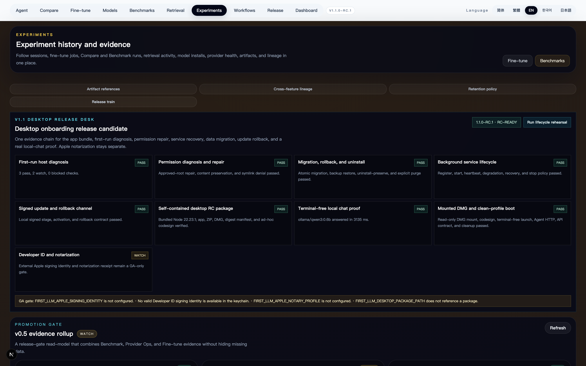

# v1.1.0-rc.1 - 2026-07-16

First LLM Studio v1.1.0-rc.1 completes the locally verifiable Desktop Onboarding milestone. It is a release candidate, not an Apple-notarized GA package.

## English

### Desktop package

- Builds a self-contained Apple Silicon `.app` from the Next.js standalone output.
- Bundles the official Node `22.23.1` arm64 runtime after verifying its published SHA-256 checksum.
- Produces ZIP and read-only DMG artifacts with a file-level release manifest.
- Uses terminal-free startup, a stable Application Support data directory, a PID file, and a durable desktop-server log.
- Applies and verifies local ad-hoc codesign. The manifest explicitly records `gaEligible: false` because Developer ID and notarization are not available in this environment.

### First-run and lifecycle

- Adds `desktop.onboarding-release.v1` as the canonical v1.1 read-model and rehearsal orchestrator.
- Combines host diagnosis, permission repair, migration and backup restore, background service recovery, signed update/rollback, package integrity, local chat, clean-profile boot, and Apple distribution status.
- Keeps `localRcReady` separate from `gaReady`; the final local result is `rc-ready` with 8 pass, 1 watch, and 0 blocked steps.
- Runs a real local Ollama `qwen3:0.6b` chat proof: 3,135 ms, 24 prompt tokens, and 5 completion tokens. Only metrics and a response digest are retained.
- Mounts the final DMG read-only, verifies codesign, starts the bundled server with an isolated data profile, checks `/agent` and `/api/desktop/onboarding-release`, stops the process, and detaches the image.

### Product surface

- Adds the v1.1 Desktop Release Desk to the first viewport of `/experiments`.
- Shows every onboarding step as an explicit pass/watch/blocked state and keeps Apple GA blockers visible.
- Promotes the public source version to `1.1.0-rc.1`, marks the v1.0 integrated baseline complete, and moves the active release train to the v1.1 RC.

## 中文

### 桌面发布包

- 从 Next.js standalone 输出构建自包含 Apple Silicon `.app`。
- 内置官方 Node `22.23.1` arm64 runtime，并校验官方发布的 SHA-256。
- 生成 ZIP、只读 DMG 和逐文件 release manifest。
- 支持无需终端的启动、稳定的 Application Support 数据目录、PID 文件和持久 server 日志。
- 执行并验证本地 ad-hoc codesign；由于当前环境没有 Developer ID/notarization，manifest 明确保留 `gaEligible: false`。

### 首次启动与生命周期

- 新增 canonical `desktop.onboarding-release.v1` read-model 和演练编排器。
- 串联主机诊断、权限修复、迁移/备份恢复、后台服务恢复、签名更新/回滚、包完整性、本地对话、clean-profile 启动与 Apple 分发状态。
- `localRcReady` 与 `gaReady` 分开；最终本地结果为 `rc-ready`，8 pass、1 watch、0 blocked。
- 使用 Ollama `qwen3:0.6b` 跑真实本地对话：3,135 ms、24 prompt tokens、5 completion tokens，只保存指标与响应摘要。
- 从最终 DMG 只读挂载 app，校验 codesign，以隔离数据目录启动内置 server，验证 `/agent` 与 Desktop API，随后停止进程并卸载镜像。

### 前台产品面

- 在 `/experiments` 首屏加入 v1.1 Desktop Release Desk。
- 每个 onboarding 步骤都显示明确 pass/watch/blocked 状态，并持续展示 Apple GA blocker。
- 公开源码版本提升为 `1.1.0-rc.1`，v1.0 一体化基线标记 complete，当前 release train 进入 v1.1 RC。

## Final artifacts

| Artifact | Bytes | SHA-256 |
| --- | ---: | --- |
| `First-LLM-Studio-1.1.0-rc.1-darwin-arm64.zip` | 85,619,017 | `d7ba933b0b0d852e490623207e9988414e61b3fd4cbe8d3fd870953a4a8cb1` |
| `First-LLM-Studio-1.1.0-rc.1-darwin-arm64.dmg` | 90,831,207 | `8051a380bf1570d61632813c4ccc2ffd3aa2b886d20477242c6dfbdf07525bc3` |

The app payload is 209,375,817 bytes. The release screenshot is `3840x2400`; its SHA-256 is `84ed387abfc0f2fe9a08de81a94012df087723358b1a867490878739e34dee99`.

## Verification

- `npm run typecheck:changed`
- `npm run build:desktop-rc`
- `npm run verify:desktop-rc`
- `npm run smoke:routes`: 113/113 pass (10 UI, 99 API, 4 compatibility headers)
- Route-smoke digest: `24d7855b4080e0f23d9bba6e3f1d7951ac587d0751a1c5a2cb0e908a8f61c6d3`

## Remaining GA gate

The release candidate is not promoted to `v1.1.0` GA until a real Developer ID identity, notarization profile, notarized/stapled package receipt, and separate clean-machine or organization acceptance receipt are available.
