# First LLM Studio

> English | [简体中文](#简体中文)

A local-first LLM studio for Apple Silicon that brings MLX local runtimes, remote API comparison, Agent sessions, Compare Lab, Fine-tune/LoRA, Benchmark, model discovery, Retrieval, Experiments, replay, trace review, runtime recovery, and telemetry into one workspace.

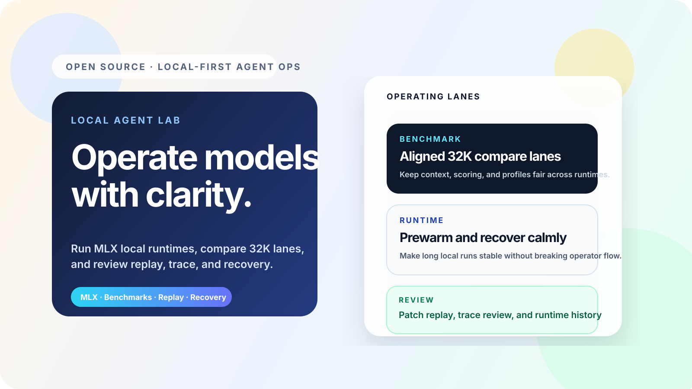

## Current Release

Current version: `v1.1.0-rc.2`.

This desktop-onboarding release candidate packages the current Studio as an Apple Silicon app with an official bundled Node runtime, ZIP/DMG artifacts, first-run diagnosis, permission and service recovery, data/update rollback rehearsals, a real Ollama local-chat proof, and clean-profile DMG boot evidence. Ad-hoc local codesign is reported separately from the still-open Developer ID/notarization GA gate.

## Product Surfaces

| Surface | Core workflow |
| --- | --- |
| Agent | Tool-enabled sessions, target catalog, runtime rail, replay, trace review, and embedded Compare entry. |
| Compare | Prompt composer, lane preview, recipe persistence, review drawer, and benchmark handoff. |
| Fine-tune | Datasets, recipes, training, evaluation, adapter proof loops, export, reports, artifacts, and LoRA chart evidence. |
| Models | Community/local model discovery, install verification, hardware fit, runtime profiles, request logs, and idle-unload state. |
| Benchmarks | Run controls, progress, baselines, reports, release evidence, fatal-target skip handling, and regression review. |
| Retrieval | Local knowledge import, chunk inspection, permission-aware retrieval, citations, and grounded query validation. |
| Experiments | Unified session/run timeline, artifact lineage, cross-links, navigation, filters, and retention. |
| Admin | Monitoring/configuration mirror for runtime, queues, provider health, compatibility usage, guardrails, and audit timelines. |

## Major Versions

| Version | Core capabilities |
| --- | --- |
| `v0.1` | Local-first studio foundation, MLX gateway workflow, target catalog, telemetry, and Agent/Admin split. |
| `v0.2` | Agent workbench expansion, Compare-style review, replay/trace inspection, runtime recovery, benchmark ops, baselines, and regression evidence. |
| `v0.3` | Fine-tune operation loops, adapter chat/export, distillation starters, operation history, partitioned typechecks, route/screenshot smoke, and launch assets. |
| `v0.4` | Foreground `/fine-tune`, `/compare`, `/models`, `/benchmarks`, `/retrieval`, and `/experiments`; feature-owned state/actions; artifact lineage; dark-glass studio/workbench style; canonical APIs with deprecated Admin compatibility wrappers. |
| `v0.4.1` | Stability baseline with dataless recovery, runtime/status fixes, real Qwen3 4B LoRA evidence, checkpoint/report/chart exports, and refreshed high-resolution screenshots. |
| `v0.4.2` | Evidence patch for GitHub/ModelScope high-resolution screenshot sync, README LFS threshold hygiene, and the first v0.5.0 Provider Health Desk v2 + Adapter Export wizard slice. |
| `v0.5` | Preview-gated Enterprise RAG, deployment registry, OpenAI-compatible API, telemetry, release-readiness gates, production attestation, quota, audit, and control-plane rehearsals. |
| `v1.0` | Integrated Agent, Compare, Model Hub, RAG, Fine-tune, Benchmark, Experiments, Admin monitoring, application APIs, route ownership, and release-evidence baseline. |
| `v1.1.0-rc.1` | Self-contained Apple Silicon app, bundled Node runtime, ZIP/DMG, first-run and lifecycle orchestration, real local-chat proof, and clean-profile boot evidence; notarization remains a GA gate. |
| `v1.1.0-rc.2` | Native arm64 launcher, nested-code/app/DMG signing workflow, dual notarization logs, staple/Gatekeeper verification, external-Mac runner, and RSA organization receipts with an out-of-band trust pin; real external evidence still gates GA. |
| `v2.4.x` | AI operations intelligence that reads real Runtime, Provider, SLO, token/cost, Benchmark, Retrieval, Agent, Workflow, and Fine-tune signals while keeping independent signed review on HOLD. |
| `v2.5.0-v2.5.4` | Deployment lifecycle contracts for portability, data sovereignty, customer keys, continuity/exit, and independent closure; production authority remains external and BLOCKED. |
| `v2.6.0-v2.6.9` | Governed autonomy readiness for model choice, provider routing, grounded context, tool permissions, protected actions, Workflow replay, quality, adapter rollback, audit provenance, and independent review. |
| `v2.7.0-v2.7.4` | Open ecosystem interoperability for OpenAI-compatible clients, MCP extensions, portable models/artifacts, workspace identity, and independent closure. |
| `v2.8.0-v2.8.9` | Operational remediation for Provider, Retrieval, model supply-chain, workspace audit, runtime, Agent, Workflow, Benchmark, and Fine-tune evidence. |
| `v2.9.0-v2.9.4` | Sustainable operations for telemetry, incident diagnostics, Admin compatibility sunset, desktop upgrade/data lifecycle, and independent closure. |
| `v3.0.0-v3.0.9` | Remediation control plane with owners, priorities, dependencies, acceptance checks, next actions, evidence fingerprints, deterministic packaging, and independent acceptance. |
| `v3.1.0-v3.1.4` | Service-readiness disclosure, support diagnostics, upgrade/change continuity, operational transition, and independent closure. |
| `v3.2.0-v3.2.9` | Idempotent, lease/fencing-protected, rollback-bound owner remediation execution and independent execution acceptance. |
| `v3.3.0-v3.3.4` | SLO/quality policy, incident/change rehearsal, owner sign-off, release decision, and independent operational acceptance. |
| `v3.4.0-v3.4.9` | Strict digest-bound owner workload requests, dry-run admission, candidate receipt validation, and independent receipt closure. |
| `v3.5.0-v3.5.4` | Evidence freshness/drift, dependency impact, owner SLA, bounded waivers, and independent decision closure. |
| `v3.6.0-v3.6.9` | Authenticated candidate receipt intake, digest-only quarantine, optimistic concurrency, compensation, and independent ledger closure. |
| `v3.7.0-v3.7.4` | SLA breach detection, acknowledgement events, bounded waiver expiry, decision packages, and independent exception closure. |
| `v3.8.0-v3.8.9` | **Planned:** official-source registry, provider discovery/routing, Agent conformance/state/cache, isolated teams, sandboxing, multimodal evaluator gating, Model Hub v3, and Local Server v3. |
| `v3.9.0-v3.9.4` | **Planned:** governed RAG lifecycle/quality, Fine-tune backend federation, Team Studio/marketplace, and a <=14-day competitive promotion gate. |

Evidence: [`v2.4.0-v2.5.4 operational lifecycle source gate`](../docs/release-evidence/v2.4.0-v2.5.4-operational-lifecycle-source-gate-2026-08-29.md) records 8 passing, 5 attention, and 2 external-only local signals; externally verified records remain `0/15`.

Plan: [`v2.6.0-v2.7.4 governed autonomy and interoperability`](../docs/v2.6.0-v2.7.4-governed-interoperability-plan-2026-08-29.md) adds 15 source-backed slices while independent ecosystem evidence remains `HOLD` and production remains `BLOCKED`.

Source gate: [`v2.6.0-v2.7.4`](../docs/release-evidence/v2.6.0-v2.7.4-governed-interoperability-source-gate-2026-08-29.md) records 9 pass, 4 attention, 0 unavailable, and 2 external-only signals; independently verified records remain `0/15`.

Previous plan: [`v2.8.0-v2.9.4 operational remediation and sustainability`](../docs/v2.8.0-v2.9.4-operational-sustainability-plan-2026-08-30.md) projects 6 pass, 7 attention, 0 unavailable, and 2 external-only owner signals. Independent evidence remains `0/15`, distribution remains `HOLD`, and production remains `BLOCKED`.

Validated source gate: [`v2.8.0-v2.9.4`](../docs/release-evidence/v2.8.0-v2.9.4-operational-sustainability-source-gate-2026-08-30.md) records 119/119 tests, 73/73 CI routes, full smoke, desktop/mobile browser QA, and the machine-readable evidence export.

Previous plan: [`v3.0.0-v3.1.4 remediation control and service readiness`](../docs/v3.0.0-v3.1.4-remediation-service-readiness-plan-2026-08-30.md) reports 5 pass, 8 attention, 0 unavailable, and 2 external-only signals. The control plane classifies 2 satisfied, 3 open, 8 blocked, and 2 external-only items; independent evidence remains `0/15` and production remains `BLOCKED`.

Previous validated source gate: [`v3.0.0-v3.1.4`](../docs/release-evidence/v3.0.0-v3.1.4-remediation-service-readiness-source-gate-2026-08-30.md) records 125/125 tests, 75/75 CI routes, full smoke, production build, security preflight, and desktop/mobile browser QA.

Latest plan: [`v3.2.0-v3.3.4 remediation execution and operational acceptance`](../docs/v3.2.0-v3.3.4-remediation-execution-operational-acceptance-plan-2026-08-30.md) gives seven owner actions deterministic idempotency, bounded leases, fencing, rollback, and evidence fingerprints. Current action state is 0 satisfied, 3 ready, and 4 blocked; independent evidence remains `0/15` and production remains `BLOCKED`.

Latest validated source gate: [`v3.2.0-v3.3.4`](../docs/release-evidence/v3.2.0-v3.3.4-remediation-execution-operational-acceptance-source-gate-2026-08-30.md) records 131/131 tests, 77/77 CI routes, full smoke, production build, security preflight, and desktop/mobile browser QA.

Current plan: [`v3.4.0-v3.5.4 owner workload and operational decision governance`](../docs/v3.4.0-v3.5.4-owner-workload-operational-decision-plan-2026-08-30.md) adds strict request and candidate receipt contracts for seven owner workloads. The source projection is 5 pass, 8 attention, and 2 external-only; external evidence remains `0/15` and production remains `BLOCKED`.

Current validated source gate: [`v3.4.0-v3.5.4`](../docs/release-evidence/v3.4.0-v3.5.4-owner-workload-operational-decision-source-gate-2026-08-30.md) records 137/137 tests, all 11 changed TypeScript partitions, 79/79 CI routes, full smoke, production build, security preflight, and desktop/mobile browser QA.

Current plan: [`v3.6.0-v3.7.4 owner receipt and exception lifecycle`](../docs/v3.6.0-v3.7.4-owner-receipt-exception-lifecycle-plan-2026-08-30.md) adds authenticated append-only receipt events, quarantine, compensation, escalation acknowledgement, bounded waiver expiry, and deterministic decision packages. The source projection is 6 pass, 7 attention, and 2 external-only; no real owner receipt was submitted during source validation, external evidence remains `0/15`, and production remains `BLOCKED`.

Current validated source gate: [`v3.6.0-v3.7.4`](../docs/release-evidence/v3.6.0-v3.7.4-owner-receipt-exception-lifecycle-source-gate-2026-08-31.md) records 146/146 tests, all 11 changed TypeScript partitions, 81/81 CI routes, full smoke, production build, release-truth validation, architecture/durable-state checks, and security preflight. The `v3.8.0-v3.9.4` competitive train remains planned work only.

## Competitive Position

First-party product and model review dated 2026-08-31. **Core** means a primary first-party workflow; **integrated** means available but not the product's deepest specialization; **ecosystem** means normally assembled through adjacent clients or plugins. Vendor benchmark claims are not First LLM Studio evidence.

| Product | Strongest position | Runtime / Model Hub | Agent / RAG | Fine-tune | Evaluation / evidence |
| --- | --- | --- | --- | --- | --- |
| **First LLM Studio** | Evidence-driven local model lifecycle | **Core**, MLX/hardware-aware | **Core**, tools + Compare + ACL/citations | **Core**, recipe/checkpoint/adapter lifecycle | **Core**, Benchmark + lineage + release gates |
| [LM Studio](https://lmstudio.ai/docs/developer/core/server) | Desktop discovery and local serving | **Core** | Integrated via API/tools/MCP | Not primary | Runtime inspection |
| [Ollama](https://docs.ollama.com/api/introduction) | Simple model runtime and packaging | **Core** | Ecosystem; native tool calling | Not primary | Ecosystem |
| [Open WebUI](https://docs.openwebui.com/features/) | Self-hosted team AI workspace | Integrated | **Core**, hybrid RAG/tools/MCP | Not primary | Integrated arena/A-B/ELO/OTel |
| [Jan](https://www.jan.ai/docs/desktop/api-server) | Open-source desktop assistant | **Core** | Integrated agents/projects/MCP | Not primary | Server logs |
| [AnythingLLM](https://docs.anythingllm.com/) | Workspace RAG and agent automation | Integrated | **Core**, flows/skills/jobs | Not primary | Flow/run inspection |
| [Dify](https://docs.dify.ai/en/develop-plugin/getting-started/choose-plugin-type) | Visual AI application delivery | Integrated | **Core**, workflow/Agent/knowledge/plugins | Not primary | Application/run inspection |
| [LLaMA-Factory](https://github.com/hiyouga/LlamaFactory) | Efficient training breadth | Training/inference tooling | Task-focused | **Core**, broad LoRA/QLoRA | **Core** training monitors |
| [ModelScope SWIFT](https://swift.readthedocs.io/en/v3.7/Instruction/Evaluation.html) | China model training and multimodal evaluation breadth | Multi-backend | Task-focused | **Core**, training/multimodal methods | **Core**, EvalScope/OpenCompass/VLMEvalKit |
| [LocalAI](https://localai.io/) | Modular private AI runtime | **Core**, broad backends/hardware | **Core**, agents/MCP/RAG | Integrated | Runtime/control-plane ops |

The current official model/Agent radar includes OpenAI `gpt-5.6-sol`, Anthropic `claude-fable-5` / `claude-opus-5` and Managed Agents, Google `gemini-3.7-flash` and Antigravity, DeepSeek V4, MiniMax M2.7, Kimi K2.6, Zhipu `glm-5.2`, and Qwen3-Coder/Qwen Code Agent Teams. It is a watchlist, not a claim that every model is locally configured or paid for.

First LLM Studio is strongest where these workflows need one reproducible evidence chain. The refreshed analysis adds 15 `planned` milestones, `v3.8.0-v3.9.4`, for provider discovery, model routing, Agent conformance/state, isolated teams, sandboxing, multimodal evaluation, Model Hub/Local Server v3, governed RAG, training federation, Team Studio, and a <=14-day competitive freshness gate. See the full bilingual [competitive landscape and product direction](../docs/competitive-landscape.md).

## Real Fine-tune / LoRA Evidence

The v0.4.2 public baseline preserves the real local Qwen3 4B LoRA run introduced in v0.4.1:

- Base model: `mlx-community/Qwen3-4B-Instruct-2507-4bit`
- Dataset: First LLM Studio starter 960, split into train/valid/test `816/96/48`
- Training: 816 steps, eval/save every 100 steps
- Peak memory: 3.316 GB
- Latest throughput: 247.4 tokens/s
- Best checkpoint: step 800, `eval_loss=0.066`
- Evidence: manifest, metrics CSV, report, chart JSON/SVG/PNG, checkpoint events, selected best checkpoint, and full archive path

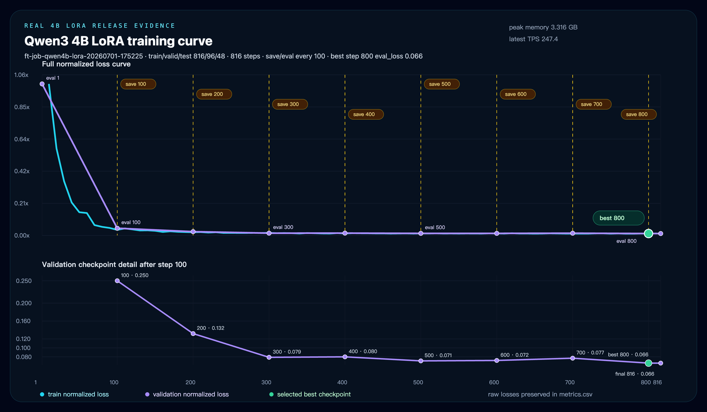

Vector chart: [`fine-tune-qwen4b-lora-chart.svg`](../docs/assets/screenshots/fine-tune-qwen4b-lora-chart.svg). Full evidence directory: [`docs/release-evidence/finetune-qwen4b-lora-2026-07-01`](../docs/release-evidence/finetune-qwen4b-lora-2026-07-01).

## Latest Live-machine Evidence

The 2026-08-30 refresh adds fresh evidence from the running local application:

- Runtime Fabric: real MLX, Ollama, and llama.cpp passed 3/3 backends, 6/6 contracts, and 42/42 normalized operations.
- Local Server: Ollama 0.31.1 + Qwen3 0.6B passed 15/15 slices with 169 ms average latency.
- Benchmark smoke: Local Qwen3 0.6B completed 3/3 runs at 234.02 tokens/s.
- MATH-500: 500/500 outputs scored and 500/500 evaluator decisions replayed; local accuracy was 32%.
- Fine-tune: the real Qwen3 4B LoRA archive preserves 816 steps and the best checkpoint at step 800.

Metrics, digests, dimensions, and evidence boundaries: [`v3.1.4-high-resolution-live-machine-capture-2026-08-30.md`](../docs/release-evidence/v3.1.4-high-resolution-live-machine-capture-2026-08-30.md). Production promotion remains `HOLD` or `BLOCKED` where independent evidence is absent.

## Screenshots

README screenshots are captured from the running local app with a 1920x1200 viewport at 2x DPR. Route screenshots reach 3840x2400; evidence panels retain high-resolution crops, and the 3360x1960 LoRA chart is exported from SVG.

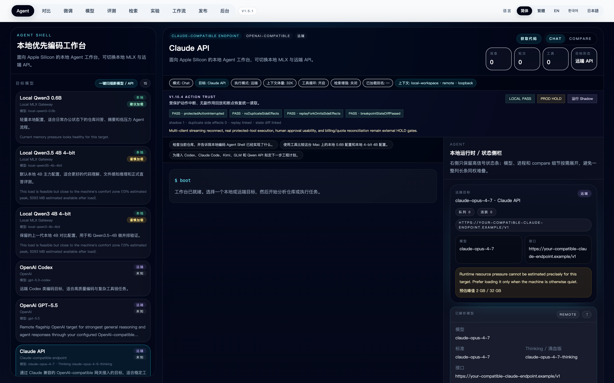

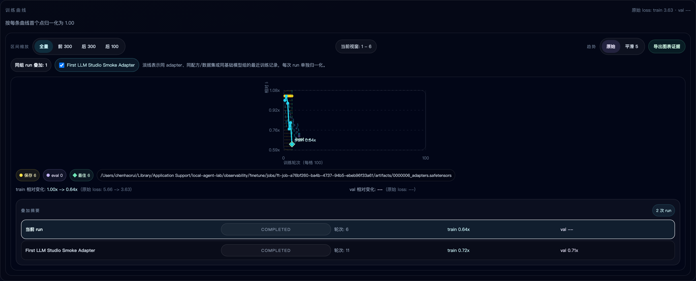

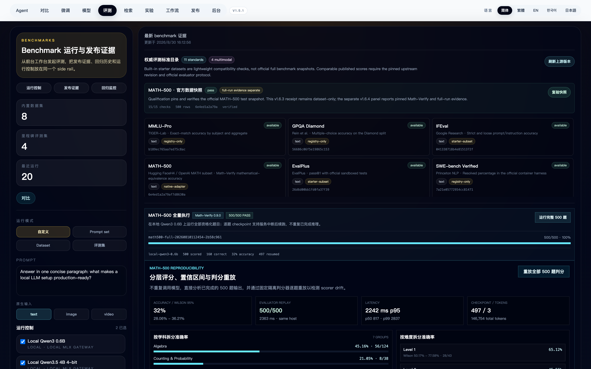
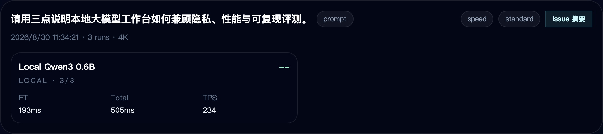
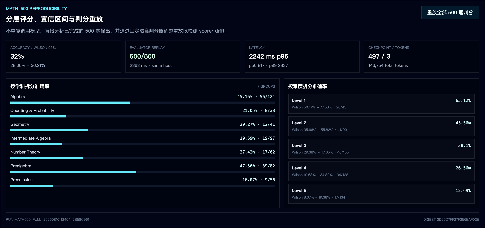
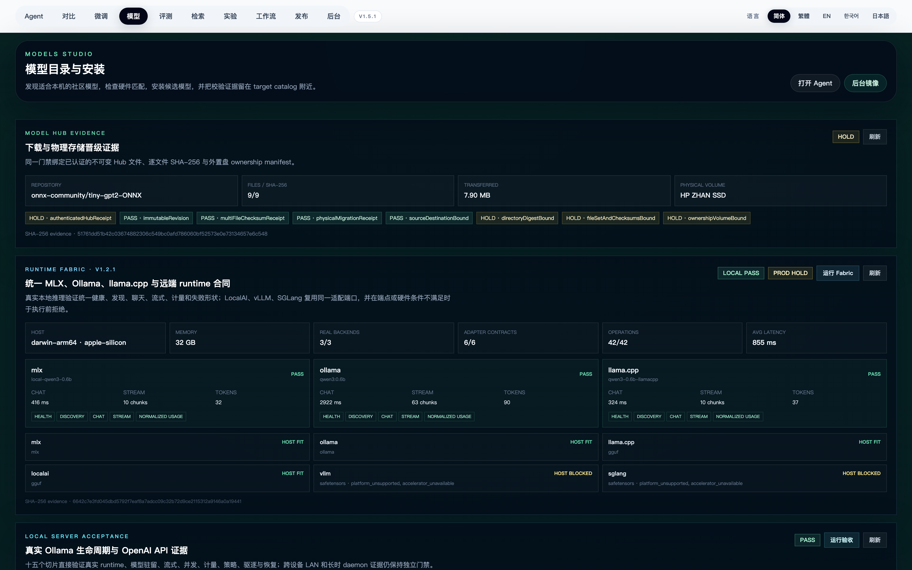
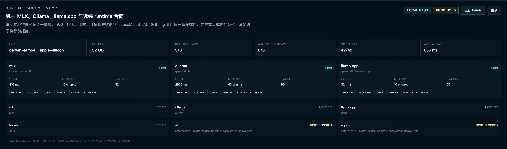
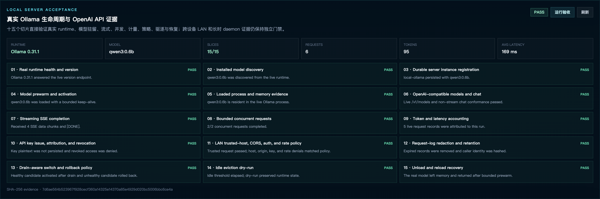
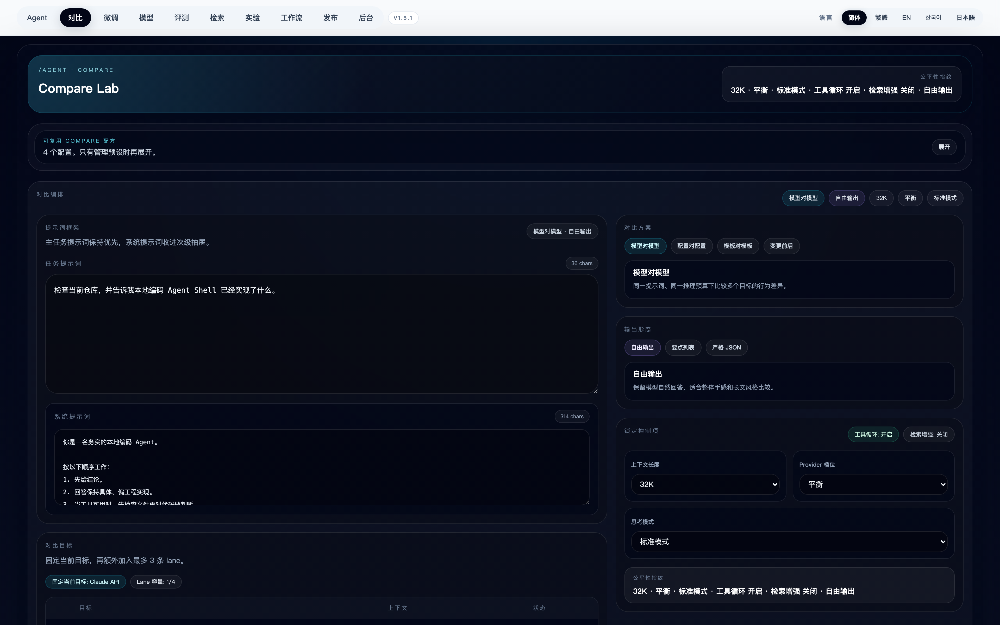
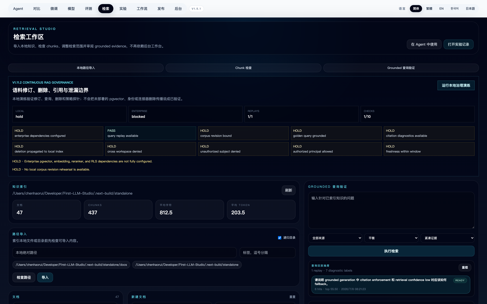
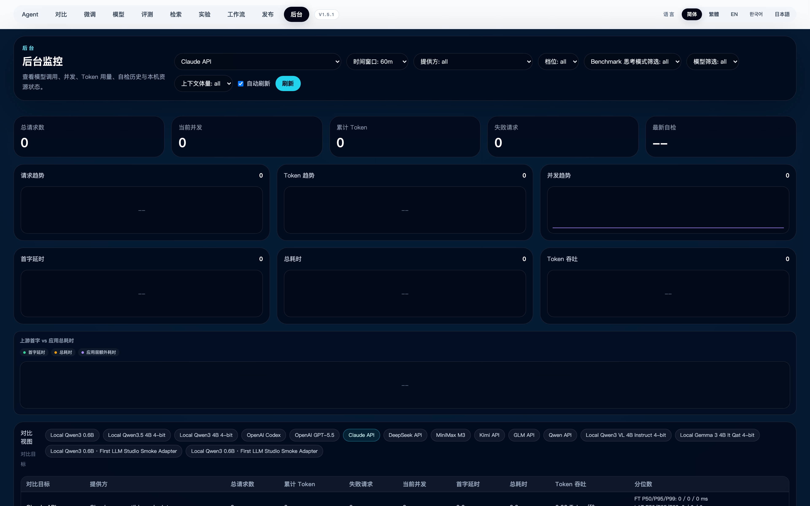
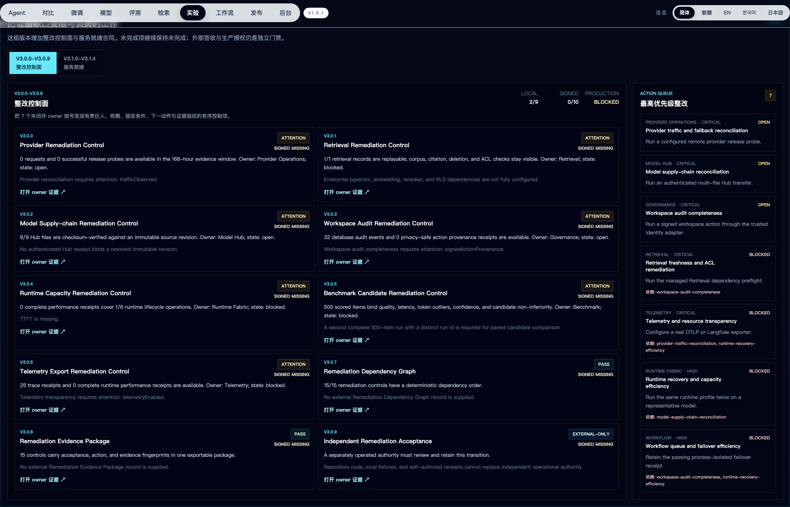

## Repository

- GitHub: [https://github.com/ChrisChen667788/Your-First-LLM-Studio](https://github.com/ChrisChen667788/Your-First-LLM-Studio)
- ModelScope profile: [https://www.modelscope.cn/profile/haozi667788](https://www.modelscope.cn/profile/haozi667788)
- Default ModelScope repo id: `haozi667788/first-llm-studio`
- Latest release note: [`v1.1.0-rc.2`](../docs/releases/v1.1.0-rc.2_2026-07-16.md)

---

# 简体中文

First LLM Studio 是面向 Apple Silicon 的本地优先 LLM 工作台，把 MLX 本地运行时、远端 API 对比、Agent 会话、Compare Lab、Fine-tune/LoRA、Benchmark、模型发现、Retrieval、Experiments、replay、trace review、runtime recovery 和模型遥测统一到一个界面里。

## 当前版本

当前版本：`v1.1.0-rc.2`。

该桌面首次启动发布候选把当前 Studio 打包为 Apple Silicon app，内置官方 Node runtime，并生成 ZIP/DMG、首次诊断、权限与服务恢复、数据/更新回滚演练、真实 Ollama 本地对话证明和 clean-profile DMG 启动证据。ad-hoc 本地 codesign 与仍待完成的 Developer ID/notarization GA 门禁会分开报告。

## 产品入口

| 模块 | 核心工作流 |
| --- | --- |
| Agent | 工具会话、target catalog、runtime rail、replay、trace review 和内嵌 Compare。 |
| Compare | Prompt 编排、lane preview、recipe 持久化、review drawer 和 benchmark handoff。 |
| Fine-tune | 数据集、配方、训练、评估、adapter proof loop、导出、报告、artifacts 和 LoRA 图表证据。 |
| Models | 社区/本地模型发现、安装验证、硬件适配、runtime profile、请求日志和 idle-unload 状态。 |
| Benchmarks | 运行控制、进度、baseline、报告、发布证据、不可用目标跳过和回归审阅。 |
| Retrieval | 本地知识导入、chunk 检查、权限过滤、引用和 grounded query 验证。 |
| Experiments | 统一 Session/Run 时间线、artifact lineage、跨功能链接、导航、筛选和 retention。 |
| Admin | Runtime、队列、provider health、compatibility usage、guardrails 和 audit timeline 的监控/配置镜像。 |

## 大版本核心功能

| 版本 | 核心能力 |
| --- | --- |
| `v0.1` | 本地优先 Studio 基础、MLX 网关工作流、target catalog、telemetry 和 Agent/Admin 分层。 |
| `v0.2` | Agent 工作台扩展、Compare 式审阅、replay/trace 检查、runtime recovery、benchmark 运维、baseline 和回归证据。 |
| `v0.3` | Fine-tune 操作循环、adapter chat/export、distillation starter、operation history、分区 typecheck、route/screenshot smoke 和发布素材。 |
| `v0.4` | 前台 `/fine-tune`、`/compare`、`/models`、`/benchmarks`、`/retrieval`、`/experiments`；feature-owned state/actions；artifact lineage；dark-glass studio/workbench 风格；canonical API 与带弃用头的 Admin compatibility wrappers。 |
| `v0.4.1` | 稳定基线：dataless recovery、runtime/status 修复、真实 Qwen3 4B LoRA 证据、checkpoint/report/chart 导出，以及最新高清截图。 |
| `v0.4.2` | 证据补丁：GitHub/ModelScope 高清截图同步、README LFS 阈值治理，以及 v0.5.0 Provider Health Desk v2 + Adapter Export wizard 第一段。 |
| `v0.5` | Preview-gated 企业 RAG、deployment registry、OpenAI-compatible API、telemetry、release-readiness gates、生产签收、quota、audit 和 control-plane rehearsal。 |
| `v1.0` | 统一 Agent、Compare、Model Hub、RAG、Fine-tune、Benchmark、Experiments、Admin 监控、application API、route ownership 和发布证据基线。 |
| `v1.1.0-rc.1` | 自包含 Apple Silicon app、内置 Node runtime、ZIP/DMG、首次启动和生命周期编排、真实本地对话证明及 clean-profile 启动证据；notarization 仍是 GA 门禁。 |
| `v1.1.0-rc.2` | 原生 arm64 launcher、内部代码/app/DMG 分层签名链、双层公证日志、staple/Gatekeeper 验证、独立 Mac 验收脚本以及带线下信任锚的 RSA 组织签收；真实外部证据仍是 GA 门禁。 |
| `v2.4.x` | AI 运行智能：读取真实 Runtime、Provider、SLO、Token/成本、Benchmark、Retrieval、Agent、Workflow 与 Fine-tune 信号，同时把独立签名复核保持为 HOLD。 |
| `v2.5.0-v2.5.4` | 部署生命周期：覆盖可移植性、数据主权、客户密钥、连续性/退出与独立闭环；生产授权继续由外部掌握并保持 BLOCKED。 |
| `v2.6.0-v2.6.9` | 受治理自治就绪度：把模型选择、Provider 路由、Grounded Context、工具权限、受保护动作、Workflow 回放、质量、Adapter 回滚和审计谱系收进一条独立复核链。 |
| `v2.7.0-v2.7.4` | 开放生态互操作：覆盖 OpenAI-compatible 客户端、MCP 扩展、模型/产物可移植性、Workspace Identity 与独立闭环。 |
| `v2.8.0-v2.8.9` | 运行整改：覆盖 Provider、Retrieval、模型供应链、Workspace 审计、Runtime、Agent、Workflow、Benchmark 与 Fine-tune 证据。 |
| `v2.9.0-v2.9.4` | 可持续运行：覆盖遥测、故障诊断、Admin compatibility sunset、桌面升级/数据生命周期与独立闭环。 |
| `v3.0.0-v3.0.9` | 整改控制面：加入 owner、优先级、依赖、验收条件、下一动作、证据指纹、确定性打包与独立签收。 |
| `v3.1.0-v3.1.4` | 服务就绪：覆盖客户披露、支持诊断、升级变更连续性、运行交接和独立闭环。 |
| `v3.2.0-v3.2.9` | 整改执行：覆盖幂等、租约/围栏、回滚、owner 执行和独立执行签收。 |
| `v3.3.0-v3.3.4` | 运营验收：覆盖 SLO/质量策略、事故/变更演练、owner 签收、发布决策和独立运营验收。 |
| `v3.4.0-v3.4.9` | Owner 工作负载准入：严格摘要绑定请求、只读准入、候选回执校验和独立回执闭环。 |
| `v3.5.0-v3.5.4` | 运营决策治理：覆盖证据时效/漂移、依赖影响、owner SLA、限时豁免和独立决策闭环。 |
| `v3.6.0-v3.6.9` | Owner 回执生命周期：带鉴权的候选回执接收、仅摘要隔离、乐观并发、补偿与独立账本闭环。 |
| `v3.7.0-v3.7.4` | 运营异常治理：SLA 超时检测、确认事件、限时豁免到期、决策包与独立异常闭环。 |
| `v3.8.0-v3.8.9` | **计划中：** 官方来源注册表、Provider 能力探测/路由、Agent conformance/state/cache、隔离团队、沙箱、多模态 evaluator gate、Model Hub v3 与 Local Server v3。 |
| `v3.9.0-v3.9.4` | **计划中：** RAG 生命周期/质量、Fine-tune 后端联邦、Team Studio/marketplace 与不超过 14 天的竞品 promotion gate。 |

证据：[`v2.4.0-v2.5.4 运行与部署生命周期 source gate`](../docs/release-evidence/v2.4.0-v2.5.4-operational-lifecycle-source-gate-2026-08-29.md) 记录了 8 个通过、5 个需关注和 2 个仅外部可满足的本地信号；独立外部签收仍为 `0/15`。

计划：[`v2.6.0-v2.7.4 受治理自治与开放生态互操作`](../docs/v2.6.0-v2.7.4-governed-interoperability-plan-2026-08-29.md) 新增 15 个 source-backed 版本切片；独立生态签收继续保持 `HOLD`，生产状态保持 `BLOCKED`。

Source gate：[`v2.6.0-v2.7.4`](../docs/release-evidence/v2.6.0-v2.7.4-governed-interoperability-source-gate-2026-08-29.md) 记录 9 个通过、4 个需关注、0 个不可用和 2 个仅外部可满足的信号；独立外部签收仍为 `0/15`。

上一阶段计划：[`v2.8.0-v2.9.4 运行整改与可持续运行`](../docs/v2.8.0-v2.9.4-operational-sustainability-plan-2026-08-30.md) 投影 6 个通过、7 个需关注、0 个不可用和 2 个仅外部可满足的 owner 信号；独立外部证据仍为 `0/15`，分发保持 `HOLD`，生产保持 `BLOCKED`。

已验证 source gate：[`v2.8.0-v2.9.4`](../docs/release-evidence/v2.8.0-v2.9.4-operational-sustainability-source-gate-2026-08-30.md) 记录 119/119 测试、73/73 CI 路由、完整 smoke、桌面/移动浏览器验证与机器可读证据导出。

上一阶段计划：[`v3.0.0-v3.1.4 整改控制与服务就绪`](../docs/v3.0.0-v3.1.4-remediation-service-readiness-plan-2026-08-30.md) 记录 5 个通过、8 个需关注、0 个不可用和 2 个仅外部可满足；控制面分类为 2 个 satisfied、3 个 open、8 个 blocked 和 2 个 external-only。独立证据仍为 `0/15`，生产保持 `BLOCKED`。

上一阶段已验证 source gate：[`v3.0.0-v3.1.4`](../docs/release-evidence/v3.0.0-v3.1.4-remediation-service-readiness-source-gate-2026-08-30.md) 记录 125/125 测试、75/75 CI 路由、完整 smoke、生产构建、安全预检和桌面/移动浏览器验证。

最新计划：[`v3.2.0-v3.3.4 整改执行与运营验收`](../docs/v3.2.0-v3.3.4-remediation-execution-operational-acceptance-plan-2026-08-30.md) 为 7 个 owner 动作增加确定性幂等、短租约、围栏、回滚和证据指纹。当前动作状态为 0 个 satisfied、3 个 ready、4 个 blocked；独立证据仍为 `0/15`，生产保持 `BLOCKED`。

最新已验证 source gate：[`v3.2.0-v3.3.4`](../docs/release-evidence/v3.2.0-v3.3.4-remediation-execution-operational-acceptance-source-gate-2026-08-30.md) 记录 131/131 测试、77/77 CI 路由、完整 smoke、生产构建、安全预检和桌面/移动浏览器验证。

当前计划：[`v3.4.0-v3.5.4 Owner 工作负载与运营决策治理`](../docs/v3.4.0-v3.5.4-owner-workload-operational-decision-plan-2026-08-30.md) 为 7 类 owner 工作负载增加严格请求与候选回执合同。源码投影为 5 个通过、8 个需关注和 2 个仅外部可满足；外部证据仍为 `0/15`，生产保持 `BLOCKED`。

当前已验证 source gate：[`v3.4.0-v3.5.4`](../docs/release-evidence/v3.4.0-v3.5.4-owner-workload-operational-decision-source-gate-2026-08-30.md) 记录 137/137 测试、全部 11 个变更 TypeScript 分区、79/79 CI 路由、完整 smoke、生产构建、安全预检和桌面/移动浏览器验证。

当前计划：[`v3.6.0-v3.7.4 Owner 回执与异常生命周期`](../docs/v3.6.0-v3.7.4-owner-receipt-exception-lifecycle-plan-2026-08-30.md) 已实现带鉴权的 append-only 回执事件、隔离、补偿、升级确认、限时豁免到期和确定性决策包。源码投影为 6 个通过、7 个需关注、2 个仅外部可满足；本轮未提交真实 owner 回执，外部证据仍为 `0/15`，生产保持 `BLOCKED`。

当前已验证 source gate：[`v3.6.0-v3.7.4`](../docs/release-evidence/v3.6.0-v3.7.4-owner-receipt-exception-lifecycle-source-gate-2026-08-31.md) 记录 146/146 测试、全部 11 个变更 TypeScript 分区、81/81 CI 路由、完整 smoke、生产构建、发布事实、架构/持久化边界和安全预检；`v3.8.0-v3.9.4` 竞品列车仍仅是计划任务。

## 竞品定位对比

本表基于 2026-08-31 可查的官方产品与模型文档。**核心**表示原生主流程，**已集成**表示具备但并非最深专长，**生态**表示通常由相邻客户端或插件组装。厂商自报 benchmark 不直接算作本项目证据。

| 产品 | 最强定位 | Runtime / Model Hub | Agent / RAG | Fine-tune | 评测 / 证据 |
| --- | --- | --- | --- | --- | --- |
| **First LLM Studio** | 证据驱动的本地模型全生命周期 | **核心**，MLX/硬件感知 | **核心**，工具 + Compare + ACL/引用 | **核心**，recipe/checkpoint/adapter lifecycle | **核心**，Benchmark + lineage + release gates |
| [LM Studio](https://lmstudio.ai/docs/developer/core/server) | 桌面模型发现和本地服务 | **核心** | 通过 API/工具/MCP 集成 | 非主线 | Runtime 检查 |
| [Ollama](https://docs.ollama.com/api/introduction) | 简洁模型运行时与打包 | **核心** | 生态；原生 tool calling | 非主线 | 生态提供 |
| [Open WebUI](https://docs.openwebui.com/features/) | 自托管团队 AI 工作区 | 已集成 | **核心**，混合 RAG/工具/MCP | 非主线 | Arena/A-B/ELO/OTel |
| [Jan](https://www.jan.ai/docs/desktop/api-server) | 开源桌面助手 | **核心** | Agent/Project/MCP | 非主线 | Server 日志 |
| [AnythingLLM](https://docs.anythingllm.com/) | Workspace RAG 与 Agent 自动化 | 已集成 | **核心**，Flow/Skill/定时任务 | 非主线 | Flow/Run 检查 |
| [Dify](https://docs.dify.ai/en/develop-plugin/getting-started/choose-plugin-type) | 可视化 AI 应用交付 | 已集成 | **核心**，Workflow/Agent/Knowledge/Plugin | 非主线 | 应用与运行检查 |
| [LLaMA-Factory](https://github.com/hiyouga/LlamaFactory) | 高效训练广度 | 训练/推理工具 | 面向任务 | **核心**，广泛 LoRA/QLoRA | **核心**，训练监控 |
| [ModelScope SWIFT](https://swift.readthedocs.io/en/v3.7/Instruction/Evaluation.html) | 国内模型训练与多模态评测广度 | 多后端 | 面向任务 | **核心**，训练/多模态方法 | **核心**，EvalScope/OpenCompass/VLMEvalKit |
| [LocalAI](https://localai.io/) | 模块化私有 AI runtime | **核心**，广后端/硬件 | **核心**，Agent/MCP/RAG | 已集成 | Runtime/控制面运维 |

当前官方模型/Agent 雷达包括 OpenAI `gpt-5.6-sol`、Anthropic `claude-fable-5` / `claude-opus-5` 与 Managed Agents、Google `gemini-3.7-flash` 与 Antigravity、DeepSeek V4、MiniMax M2.7、Kimi K2.6、智谱 `glm-5.2` 以及 Qwen3-Coder / Qwen Code Agent Team。它不代表本机已配置或购买全部模型。

First LLM Studio 在统一证据链上更有优势。最新版已把 provider 型号漂移、Agent 长任务/多 Agent/沙箱、Local Server、RAG connector/index、训练后端广度和团队治理差距拆成 `v3.8.0-v3.9.4` 15 个 `planned` 版本，并加入不超过 14 天的竞品 freshness gate。完整双语分析见：[竞品格局与产品方向](../docs/competitive-landscape.md)。

## 真实 Fine-tune / LoRA 证据

v0.4.2 公开基线继续保留 v0.4.1 引入的真实本地 Qwen3 4B LoRA 训练：

- 基座模型：`mlx-community/Qwen3-4B-Instruct-2507-4bit`
- 数据集：First LLM Studio starter 960，训练/验证/测试 `816/96/48`
- 训练：816 steps，eval/save every 100 steps
- 峰值内存：3.316 GB
- 最新吞吐：247.4 tokens/s
- 最佳 checkpoint：step 800，`eval_loss=0.066`
- 证据：manifest、metrics CSV、report、chart JSON/SVG/PNG、checkpoint events、selected best checkpoint 和 full archive path

矢量图：[`fine-tune-qwen4b-lora-chart.svg`](../docs/assets/screenshots/fine-tune-qwen4b-lora-chart.svg)。完整证据目录：[`docs/release-evidence/finetune-qwen4b-lora-2026-07-01`](../docs/release-evidence/finetune-qwen4b-lora-2026-07-01)。

## 最新真机证据

2026-08-30 的证据刷新从当前运行中的应用生成了新一批高清实机材料：

- Runtime Fabric：真实 MLX、Ollama、llama.cpp 3/3 后端通过，contract 6/6，标准化操作 42/42。
- Local Server：Ollama 0.31.1 + Qwen3 0.6B 通过 15/15 项，平均延迟 169 ms。
- Benchmark smoke：Local Qwen3 0.6B 完成 3/3 次运行，吞吐 234.02 tokens/s。
- MATH-500：完整 500 题全部判分，判分决定 500/500 重放一致，本地准确率 32%。
- Fine-tune：真实 Qwen3 4B LoRA 归档保留 816 steps 和 step 800 最佳 checkpoint。

完整指标、摘要、尺寸与证据边界见：[`v3.1.4-high-resolution-live-machine-capture-2026-08-30.md`](../docs/release-evidence/v3.1.4-high-resolution-live-machine-capture-2026-08-30.md)。缺少独立外部证据的生产晋级继续保持 `HOLD` 或 `BLOCKED`。

## 截图

README 截图来自本地运行版本，使用 1920x1200 视口按 2x DPR 生成。路由图达到 3840x2400；证据面板保留高清裁切，3360x1960 LoRA 图从 SVG 导出。

## 仓库地址

- GitHub: [https://github.com/ChrisChen667788/Your-First-LLM-Studio](https://github.com/ChrisChen667788/Your-First-LLM-Studio)
- ModelScope 主页: [https://www.modelscope.cn/profile/haozi667788](https://www.modelscope.cn/profile/haozi667788)
- 默认 ModelScope repo id：`haozi667788/first-llm-studio`
- 最新版本说明：[`v1.1.0-rc.2`](../docs/releases/v1.1.0-rc.2_2026-07-16.md)
